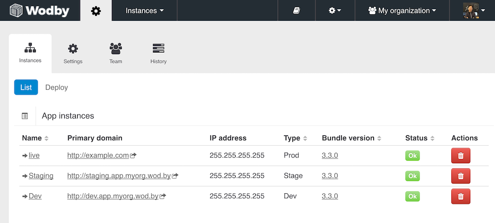

# Instances

!!! info "All apps have instances" 
    Every application deployed via Wodby has at least one instance. In other words, when we say app what we really mean is [application instance](instances.md). 

## What is instance?
ℹ️ This update requires server infrastructure at least 5.9.0
Application instance is a single isolated environment of your application (dev, staging, prod, feature, etc). Every app can have an unlimited number of instances but at least one. By default we deploy development (or just dev) instance of your application. But you can deploy as many instances as you want. You can also deploy instances of the same applications across different servers/clusters.

You can remove or add a new instance from the `Instances` page. To get there navigate to the instance page and click on a cogwheel in the header.

!!! warning "Instances' data"
    As for infrastructure 5.x when you delete an instance we do not delete its backups and files. See [this article](../infrastructure/disk.md#freeing-disk-space) to learn how to clean them up.
    
## Instance type

There are 3 types of instances provided by default: dev, staging and production. The difference between instance types depends on a stack (see your stack documentation) but usually they differ in error reporting level, e.g. show all errors on dev instances and none on production. Some stacks may have no difference in configuration for different instance types, in this case, we recommend using production instance type in case changes affecting this behaviour will be introduced in future.

How prod environments are different:

* Health checks enabled for all containers
* Less errors show up
