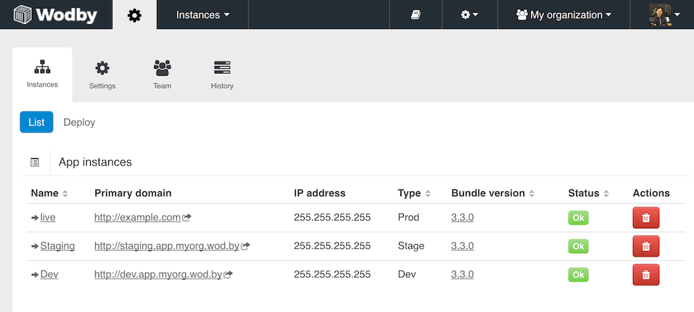

# Instances

!!! info "All apps have instances" 
    Every application deployed via Wodby has at least one instance. In other words, when we say app what we really mean is [application instance](instances.md). 

## What is instance?

Application instance is a single isolated environment of your application (dev, staging, prod, feature, etc). Every app can have an unlimited number of instances but at least one. By default we deploy development (or just dev) instance of your application. But you can deploy as many instances as you want. You can also deploy instances of the same applications across different servers/clusters.

You can remove or add a new instance from the `Instances` page. To get there navigate to the instance page and click on a cogwheel in the header.

## Deleting an instance

Deleting an instance removes its Wodby control-plane record, domains, ports,
properties, task history, stack assignment, and CI build records. Managed image
tags for its CI builds are scheduled for deletion from Wodby's registry. The
runtime workloads are undeployed and their namespace/state is cleared from the
connected server.

Persistent application and backup files can remain physically present on a
single-server host even after their Wodby records are removed. This protects
data from being silently destroyed, but it also means deleting an instance does
not necessarily reclaim all server disk space. See
[Application and backup data](../infrastructure/disk.md#application-and-backup-data)
before removing retained data or decommissioning the server.

!!! warning "Deleting the last instance"
    Every application must have an instance. Deleting its last instance also
    deletes the application and its application-level configuration.
    
## Instance type

There are 3 types of instances provided by default: dev, staging and production. The difference between instance types depends on a stack (see your stack documentation) but usually they differ in error reporting level, e.g. show all errors on dev instances and none on production. Some stacks may have no difference in configuration for different instance types, in this case, we recommend using production instance type in case changes affecting this behaviour will be introduced in future.

How prod environments are different:

* Health checks enabled for all containers
* Less errors show up
