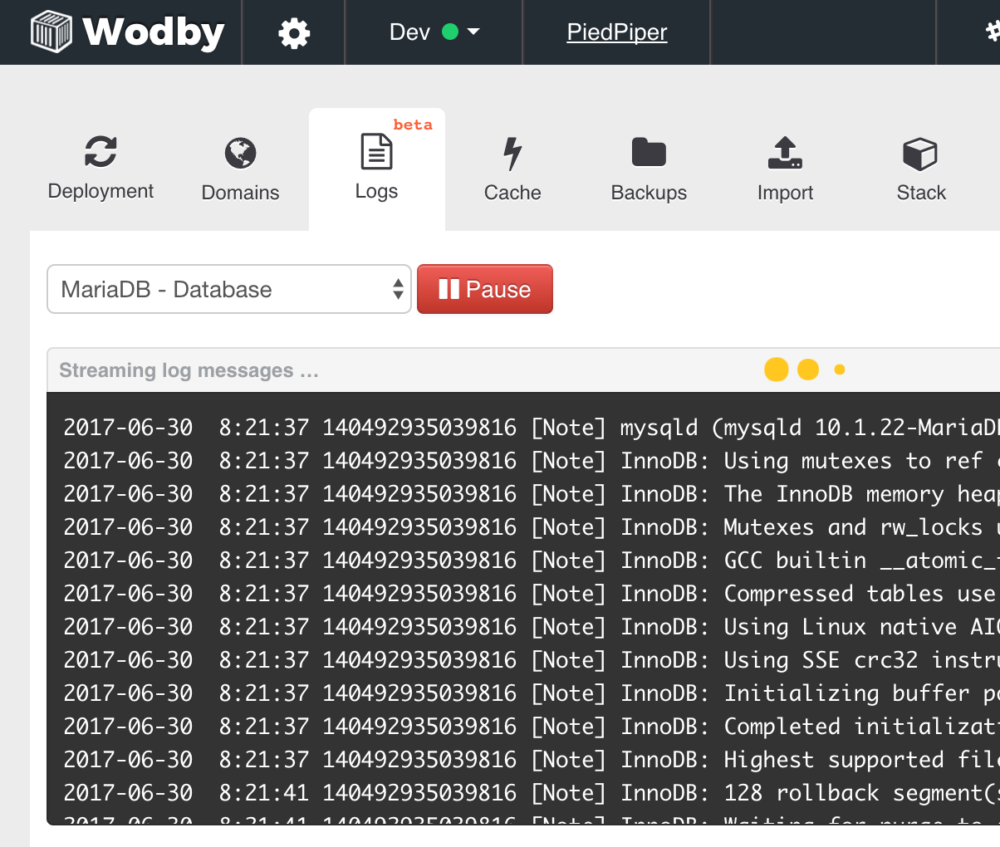

# Logging

Most containers in Wodby-managed stacks send application logs to standard output and standard error, where Docker and Kubernetes collect them. Container logs are not persistent application storage and may be lost after Pod replacement, log rotation, or server maintenance.

There are two ways to view application logs:

## Log streaming from dashboard

Go to `Instance > Logs`, choose a service, and click `Stream`. Wodby fetches recent messages and continues polling for new output.

Infrastructure 7 dashboard log streaming requires Agent 5.4.2 or newer. See [infrastructure maintenance](../infrastructure/maintenance.md) if an Infrastructure 7 server still runs an earlier Agent.




## CLI with kubectl

Go to `Instance > Stack > Service` and copy the `Show logs` command. Connect to the host server as root and run it. You can also use:

```shell
kubectl -n INSTANCE_UUID logs deployment/SERVICE_NAME --since=30m --timestamps
```

Adjust `--since` or use `--tail` to control the returned history. See the current [kubectl logs reference](https://kubernetes.io/docs/reference/kubectl/generated/kubectl_logs/).

Infrastructure 7 configures root's default kubeconfig. If it is not available in the current shell, add `--kubeconfig=/etc/kubernetes/admin.conf` to the command.

Some software additionally writes files inside its container. Those files are retained only when their path is backed by a persistent volume. Applications can also forward logs to an external logging service or a stack-provided syslog service.
