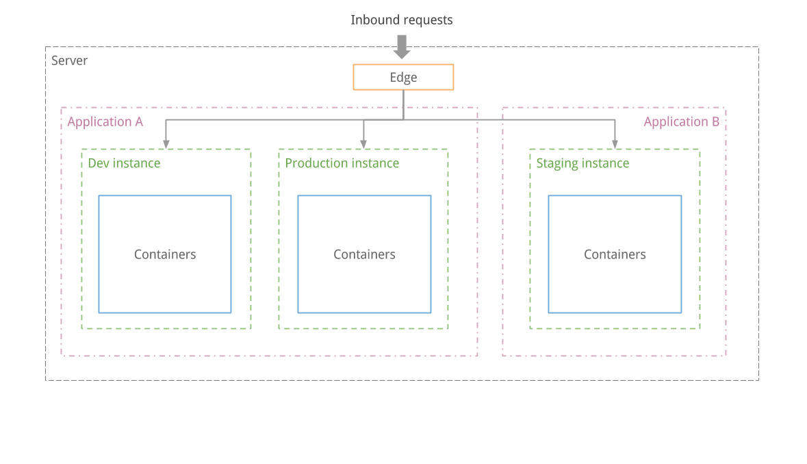

# Single-server infrastructure

## Overview

When you connect a server to Wodby 1, Wodby installs a single-node, container-based infrastructure used to deploy your applications and stacks.

!!! info "Wodby is not hosting provider"
    Wodby is not a hosting provider. We believe that there are plenty of reliable providers on the market already. You can connect your own servers from any hosting provider. By connecting your server, you let Wodby install infrastructure that will be used to deploy your apps.

Infrastructure and stacks are versioned and maintained separately. Infrastructure updates can include operating-system compatibility, security fixes, and component upgrades.

* [Infrastructure maintenance](maintenance.md)
* [Stacks maintenance](../stacks/maintenance.md)

The infrastructure is powered by Docker and Kubernetes. The Wodby Agent applies operations requested by the Wodby 1 backend, and Edge terminates TLS and proxies public traffic to application services.

## Infrastructure generations

### Infrastructure 7

Infrastructure 7 is the default for newly connected servers. It supports fresh Ubuntu 26.04 and Debian 13 amd64 hosts and uses current Docker, Kubernetes, etcd v3, Agent, and Edge components.

Infrastructure 7 is not an in-place upgrade for Infrastructure 6. To move an existing server to Infrastructure 7, connect a fresh supported host and migrate or redeploy the applications to it.

### Infrastructure 6

Infrastructure 6 is the legacy line used by existing Wodby 1 servers. Its installation, operating-system, and maintenance instructions remain separate from Infrastructure 7. Do not run the Infrastructure 7 installer on an existing Infrastructure 6 server.

See [infrastructure maintenance](maintenance.md) for the current release profiles and upgrade policy.

## Schema

Edge is a reverse proxy container based on nginx. It proxies requests to application instances, performs configured redirects, and terminates TLS.

