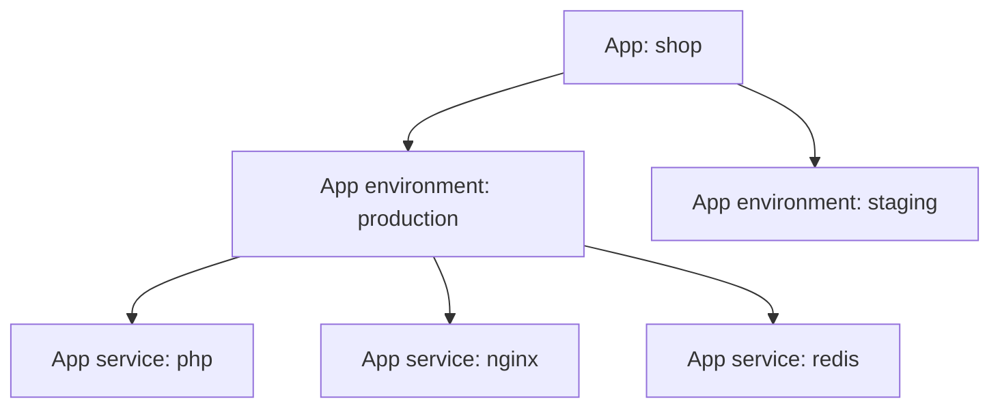

# App vs App Environment vs App Service

These three terms describe different layers of the same application model.

## Quick model

| Object | What it represents | Example | Where you work with it most |
| --- | --- | --- | --- |
| App | The top-level application record built on one stack | `shop` | `Apps` |
| App environment | One deployed copy of that app with an environment type | `prod-eu`, `staging`, `dev` | `Apps > [App] > Environments` |
| App service | One service inside one app environment | `php`, `nginx`, `redis`, `postgres` | `Apps > [App] > [Environment] > Stack > App services` |

## Relationship

## App

An app is the top-level product object.

It groups:

- all environments of the same application
- one stack and its revisions
- app-wide identity such as name and machine name

The app itself is the organizing record. The actual running copies of the application are its app environments.

The app machine name is permanent. It must follow the [general Kubernetes name rules](../naming.md#general-kubernetes-names): lowercase letters, numbers, and dashes only; start and end with a letter or number; 63 characters or shorter.

All app environments of the same app share that stack, but each environment can run a different stack revision and can be deployed to a different cluster.

Typical app-level actions:

- create the app
- rename the app
- view all environments

## App environment

An app environment is one actual deployed copy of the app running on a Kubernetes cluster. It has a fixed
[environment type](environment-types.md): `prod`, `staging`, `test`, `dev`, or `feature`.

The environment machine name follows the same general naming rule as app names. Together, the app and environment names form a Kubernetes namespace as `<app-name>-<environment-name>`, which must also be 63 characters or shorter.

An environment has its own:

- cluster destination
- environment type
- routes and ports
- builds and deploys
- backups and imports
- cron schedules
- app services

Sibling environments of the same app can run on different clusters and different stack revisions.

## App service

An app service is one service inside one app environment.

It represents one actual part of the deployed application. For most services that means a workload Wodby deploys to Kubernetes. For external services it means a configured connection to software running outside Wodby.

This is where you override per-environment service behavior such as:

- enabled state
- version
- replicas
- database attachment
- integrations
- environment variables
- Helm values
- resources
- links
- configs
- tokens
- annotations

If the same app has both `production` and `staging`, each environment gets its own app services.

## Rule of thumb

- If you are deciding **which deployed copy of an app** to work with, you are working with an **app environment**.
- If you are changing **how one part of the deployed app behaves**, you are working with an **app service**.
- If you are looking at the **whole product across environments**, you are working with an **app**.

## Related pages

- [Applications overview](index.md)
- [Environments](environments.md)
- [App services](services.md)
- [Application stack](stack.md)
