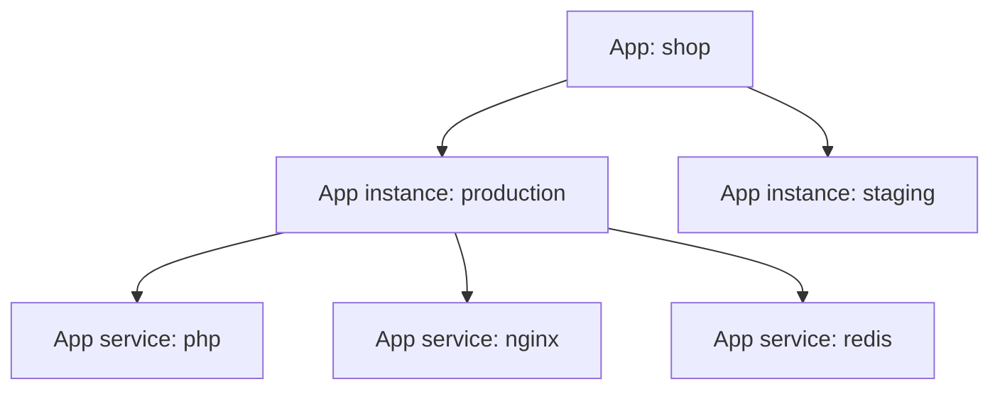

# App vs App Instance vs App Service

These three terms describe different layers of the same application model.

## Quick model

| Object | What it represents | Example | Where you work with it most |
| --- | --- | --- | --- |
| App | The top-level application record built on one stack | `shop` | `Apps` |
| App instance | One deployed copy of that app, assigned to an Env | `prod-eu`, `staging`, `dev` | `Apps > [App] > Instances` |
| App service | One service inside one app instance | `php`, `nginx`, `redis`, `postgres` | `Apps > [App] > [Instance] > Services` |

## Relationship

## App

An app is the top-level product object.

It groups:

- all instances of the same application
- one stack and its revisions
- app-wide identity such as name and machine name

The app itself is the organizing record. The actual running copies of the application are its app instances.

All app instances of the same app share that stack, but each instance can run a different stack revision and can be deployed to a different cluster.

Typical app-level actions:

- create the app
- rename the app
- view all instances

## App instance

An app instance is one actual deployed copy of the app running on a Kubernetes cluster.

Each instance is assigned to a named Environment (Env).

An Env also has a type chosen from a fixed enum: `prod`, `staging`, `test`, `dev`, or `feature`.

Multiple Envs can share the same type. For example, `Production EU` and `Production US` can both be `prod`.

An instance has its own:

- cluster destination
- environment
- domains and ports
- builds and deploys
- backups and imports
- cron schedules
- app services

Sibling instances of the same app can run on different clusters and different stack revisions.

## App service

An app service is one service inside one app instance.

It represents one actual part of the deployed application. For most services that means a workload Wodby deploys to Kubernetes. For external services it means a configured connection to software running outside Wodby.

This is where you override per-instance service behavior such as:

- enabled state
- version
- replicas
- database attachment
- integrations
- environment variables
- Helm values
- resources
- links
- configs
- tokens
- annotations

If the same app has both `production` and `staging`, each instance gets its own app services.

## Rule of thumb

- If you are deciding **which app copy or Env** to deploy, you are working with an **app instance**.
- If you are changing **how one part of the deployed app behaves**, you are working with an **app service**.
- If you are looking at the **whole product across environments**, you are working with an **app**.

## Related pages

- [Applications overview](index.md)
- [Instances](instances.md)
- [App services](services.md)
- [Application stack](stack.md)
