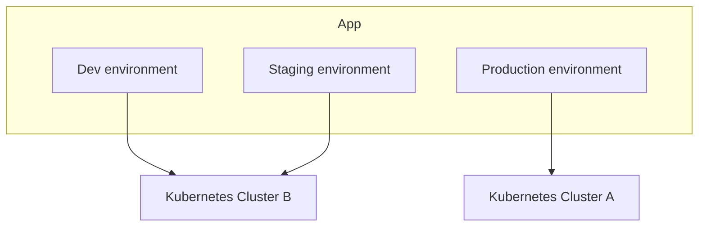

# App environments

An app environment is one isolated deployment of your application on a [Kubernetes cluster](../clusters/index.md).

Each app environment has its own:

- [Environment type](environment-types.md), such as `prod`, `staging`, or `dev`
- [Stack](stack.md) revision
- [Endpoints](endpoints.md) to configure HTTP routes and published ports
- [Maintenance mode](maintenance.md) to temporarily replace public HTTP routes with a maintenance response
- [App Access](access.md) to choose public, identity-protected, or private-network HTTP access
- [Builds](builds.md) and [deploys](deploys.md), when the stack has services with build configuration
- CI provider and container registry selections
- [Backups](backups.md) and [imports](imports.md), when the stack provides those capabilities
- [App services](services.md) used to override stack configuration for this specific environment
- [Metrics](observability.md#metrics), when cluster monitoring is enabled
- live [log streaming](observability.md#live-logs)
- [Cron](cron.md) schedules and jobs
- [Tasks](tasks.md) history

All environments of the same app share the same stack, but different environments can run on different clusters and different stack revisions.

App environments do not have a separate project owner. They belong to the app and use the app's ownership and sharing settings.

The environment machine name is permanent and must follow the [general Kubernetes name rules](../naming.md#general-kubernetes-names). The generated namespace, `<app-name>-<environment-name>`, must be 63 characters or shorter.

You add or remove environments from `Apps > [App] > Environments`.

New environments start with the organization's [default CI provider and container registry](../org.md#settings). These
values are copied at creation time rather than inherited dynamically: changing an organization default affects future
environments only. An environment retains its selection even when it currently has no enabled service with build
configuration, so the same provider is ready if a buildable service is enabled or added later.

To change an existing environment, open `Apps > [App] > [Environment] > Settings > CI/CD`. The tab remains available when
the environment has no active buildable services, and saves the selection for services that are enabled or added later.
Changes apply to future builds. Existing builds keep the CI provider, registry, and registry repository recorded when
those builds were created.

## Copying configuration to a new environment

When you add an environment to an existing app, Step 4 shows `Copy configuration from`. Select another environment of the
same app and confirm to prefill compatible configuration for the new environment:

- CI and container registry selections
- public build boilerplate selections and connected Git repositories
- service settings and integrations
- volume sizes
- existing database selections for compatible external database services

Only fields supported by the selected stack revision and integrations available to you are copied. Review both App
settings and Services before creating the environment. App Access, imports, backups, volume data, and database data are
not copied.

When the source environment was created by cloning a boilerplate into your Git account, the new environment connects to that
resulting repository. It does not clone the boilerplate into another repository. A public boilerplate source remains a
public boilerplate when the same boilerplate is available in the selected stack revision.

!!! warning
    This warning appears in the dashboard only when the stack has an enabled external database service. If the source
    environment uses an existing database, copying its configuration can select that same database for the new environment.
    Both environments would connect to one database; Wodby does not clone its data. To keep the environments isolated, review
    the `Databases` section and select a different database server or choose `Create new` in the `DB` field.

## Pausing and resuming an environment

Pausing and [maintenance mode](maintenance.md) serve different purposes. Maintenance mode keeps workloads running and
temporarily replaces public HTTP routes with a maintenance response. Pause an environment when you want its application
workloads and scheduled jobs to stop.

Open an app environment's `Settings` tab. Settings opens on `Edit` by default; select `Pause & Resume`, then
`Pause app environment`, when you want to stop the environment temporarily without deleting its configuration or data.
Pausing is available on paid plans. Resuming remains available so you can leave the paused state before a downgrade.

The status in this tab is `Running` during normal operation. It changes to `Pausing` while workloads are being stopped,
`Paused` after Kubernetes verifies the pause, and `Resuming` while workloads are being restored.

Pausing cancels active work for the environment, then:

- scales Deployments and StatefulSets to zero
- stops scheduled jobs and removes other active Kubernetes workload resources
- releases the workloads' requested compute and memory back to the cluster
- leaves routes, configuration, secrets, persistent volumes, and Helm releases in place

Automatic cron jobs and backups that become due while the environment is `Pausing`, `Paused`, or `Resuming` are skipped.
Wodby advances each schedule to its next run instead of queueing the missed execution for after resume. Managed
technical-domain certificates can still renew through DNS validation while the environment is paused, but renewal does
not restore or redeploy application workloads. On infrastructure version `4.0.0` or newer, routing changes made while
the environment is paused remain pending and are applied after its workloads are restored.

The environment's endpoints do not respond while it is paused. Persistent volumes and their data remain provisioned so the
environment can be resumed later. A pause has no automatic expiration.

After Kubernetes verifies that the workloads have stopped, the environment moves to `paused`. Select
`Resume app environment` from the same `Pause & Resume` tab to make its services count toward plan usage again and restore
the workloads and endpoints. Infrastructure app environments cannot be paused independently.

### Billing while paused

An environment continues to count toward app-service plan usage while the pause is in progress. After Kubernetes verifies
the pause, its enabled app services no longer count toward that usage. They count again before workloads are restored
when the environment resumes. Pausing does not cancel the organization's subscription, and the Team plan's $48 monthly
minimum still applies. A paid subscription cannot be downgraded while an environment is `Pausing` or `Paused`: wait for
any pause in progress to finish, resume every paused environment, then retry the downgrade. See
[Billing](../pricing.md#downgrading-a-paid-subscription).

For environments running on Wodby Cloud, persistent storage and cluster infrastructure are billed separately. Pausing an
environment does not itself resize or stop its cluster, although the freed workload capacity may allow a scalable cluster
to reduce its node count. This Wodby Cloud infrastructure note does not apply to clusters in your own cloud account,
where infrastructure costs are determined by your provider.

## Deleting an environment

Deleting an app environment marks it as `deleting` immediately and blocks new builds and deployments from starting.

Before Kubernetes cleanup begins, the deletion task cancels active builds, deployments, and post-deployment script
tasks for the environment and waits for each task to stop. It then removes the environment's Kubernetes resources and other
generated resources. Follow the deletion task logs to see which active tasks were canceled and whether cleanup
completed.

Deleting an app applies the same process to all of its environments.

## Errored environments

An app environment can move to `errored` when Wodby cannot finish creating it or cannot finish deletion cleanup.

Errored environments remain visible so you can inspect task logs and delete the environment. Operations that would create new
runtime work or change deployable configuration are blocked, including new builds and deployments, stack upgrades,
service configuration changes, route and auth changes, app-scoped backups, cron jobs, shell sessions, live logs, pod
queries, and container-backed database changes. Automatic app-scoped backups and cron jobs skip errored environments.
Managed technical-domain certificates can still renew through DNS validation, without deploying application workloads.

Review the failed task to find the cause. After fixing the underlying problem, delete the errored environment and create a
new one.

## Related pages

- [Applications overview](index.md)
- [App vs app environment vs app service](app-vs-environment-vs-service.md)
- [Maintenance mode](maintenance.md)
- [Application stack](stack.md)
