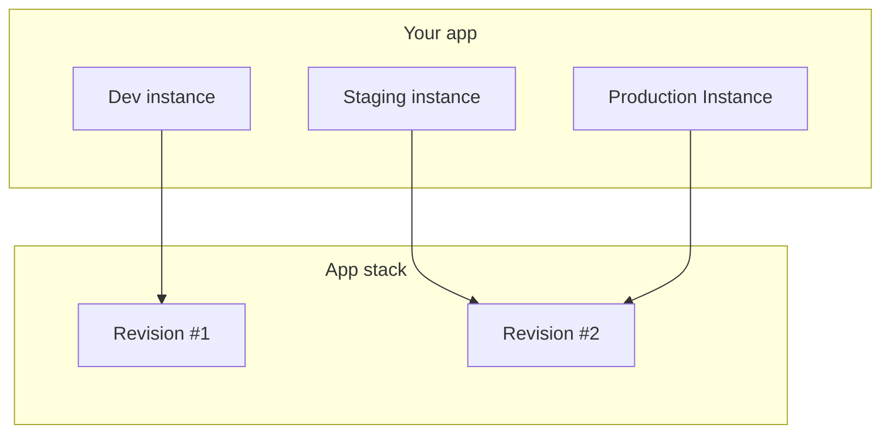

# Applications

## Overview

An application in Wodby is built on a [stack](stack.md) and can contain multiple [instances](instances.md), each representing different [environments](env.md) such as production, staging, and development. Creating a new application automatically generates its first instance.

- Every app can have an unlimited number of instances but at least one
- You can deploy as many instances as you want
- You can also deploy instances of the same applications across different [kubernetes clusters](../kubernetes/index.md)
- One stack per application
- Different instances can have different revisions of the same stack

## Creating New Application

There are 5 steps of creating a new application:

### Step 1

- Select a [project](../projects.md) where you want to place your new application
- Select a stack
- Optionally, if the stack has buildable services:
  - choose your [CI system](../cicd/index.md) ([Wodby CI](../cicd/wodby-ci.md) by default)
  - choose your [container registry](../cicd/index.md) ([Wodby registry](../cicd/wodby-registry.md) by default) 
- In the selected stack you can:
  - select a version (option) of a service 
  - enable/disable optional services and change their configuration
  - configure resources request and limitation
  - configure autoscaling for scalable services

### Step 2

Select a kubernetes cluster where you'd like to deploy the first instance of your application. You can either:

1. Choose one of your existing clusters created from Wodby dashboard using [integration](../integrations/index.md) with a managed Kubernetes cloud provider 
2. Use one of the clusters provided by Wodby. For now, we only offer temporary demo clusters that will be destroyed automatically after 12 hours

### Step 3

- Enter the name of your application and your instance. Application and instance names are used to generate machine names. Machine names are permanent and cannot be changed
- Select the [environment](env.md) (_Development_ by default)   
- Optionally, edit the root domain. By default, it's `*.[instance-name].[app-name].[org-name].wodby.app`. Root domain used to generate [technical domains](index.md) for services that provide http ports

### Step 4

#### Build sources

For [buildable](../cicd/index.md) services select a build source. Build source is a git repository that contains a build pipeline manifests. Usually, services provide a public template, that you can either use directly or clone it. You can also use your own git repository 

#### Settings 

Configure [settings](../services/index.md#settings) for service that provide such

#### Volumes 

Specify sizes for persistent volumes. Some services, like Redis, may provide optional volumes, for those specifying `0` size would mean there will be no persistent storage  

#### Integrations

Select [integrations](../integrations/index.md). If a service does not provide specific integrations, you can always add a [_variable_](../integrations/variable.md) integration for non-external services

#### Databases

For _Database_ services you can optionally select an existing database server. By default, a new database server will be created for you

#### Imports

Specify imports. For services that provide import function (e.g. Database service), you can upload an archive or specify a public URL to import from

### Step 5

Review your application configuration and click _Create new app_.
