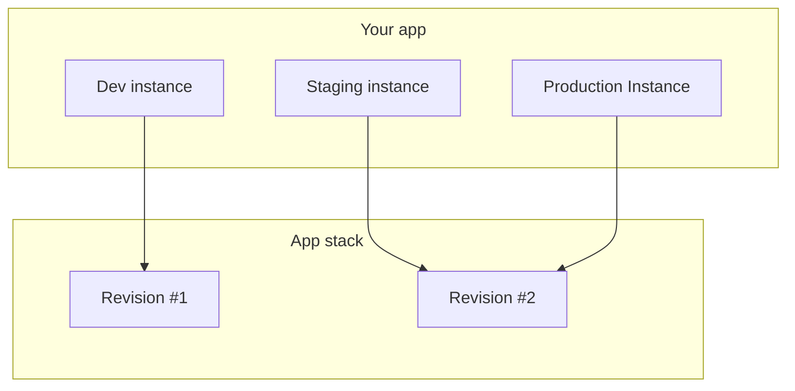

# Applications

## Overview

An application in Wodby is built on a [stack](stack.md) and can contain multiple [instances](instances.md). Each instance is a deployed copy of the app assigned to an [environment](env.md). Environments are named objects with a fixed type such as `prod`, `staging`, or `dev`. Creating a new application automatically generates its first instance.

- Every app can have an unlimited number of instances but at least one
- You can deploy as many instances as you want
- You can deploy instances of the same app across different [Kubernetes clusters](../kubernetes/index.md), including self-hosted K3S clusters on different servers
- One stack per application
- Different instances can have different revisions of the same stack

```mermaid
flowchart TD
    subgraph App2["<div style='margin-top:10px; white-space: nowrap;'>Your app</div>"]
        subgraph group[ ]
            Dev["Dev instance"]
            Staging["Staging instance"]
            Prod["Production Instance"]
        end
        style group fill:none,stroke:none,stroke-width:0px
    end   

    subgraph Stack["<div style='margin-top:10px; margin-right: 60px; white-space: nowrap;'>App stack</div>"]
        subgraph group3[ ]
            Rev1["Revision #1"]
            Rev2["Revision #2"]
        end
        style group3 fill:none,stroke:none,stroke-width:0px            
    end
    
    Dev --> Rev1
    Staging --> Rev2
    Prod --> Rev2
```

Use this section to create apps, understand how apps, instances, and app services relate, and deploy the same app across multiple environments.

## Quick model

| Object | What it means |
| --- | --- |
| App | The top-level application record |
| App instance | One deployed copy of that app, assigned to an Env |
| App service | One service inside one app instance |

See [App vs app instance vs app service](app-vs-instance-vs-service.md) for the fuller explanation.

## Creating New Application

There are 5 steps of creating a new application:

### Step 1

- Select the app `Owner`.
  - Choose `Organization <organization>` to create an organization-owned app.
  - Choose `Project <project>` to create a project-owned app.
- Select a stack
- Optionally, if the stack has services with build configuration:
  - choose your [CI system](../cicd/index.md) ([Wodby CI](../cicd/wodby-ci.md) by default)
  - choose your [container registry](../cicd/index.md) ([Wodby registry](../cicd/wodby-registry.md) by default) 
- In the selected stack you can:
  - select a version (option) of a service 
  - enable/disable optional services and change their configuration
  - configure resources request and limitation
  - configure autoscaling for scalable services

### Step 2

Select where you want to run the first instance of your application. The form offers two destinations:

1. **My clusters**
   - Choose one of your existing clusters
   - This can be a managed Kubernetes cluster created from a cloud [integration](../integrations/index.md)
   - It can also be a self-hosted [K3S](../kubernetes/k3s.md) cluster connected from _Clusters > Connect server_
2. **Wodby Cloud**
   - Wodby creates and manages a new cluster for this application
   - For persistent Wodby Cloud clusters you choose region, CPU type, machine type, and minimum and maximum node counts
   - Enable `Single-node cluster` when one fixed node is acceptable and you do not need high availability or cluster scaling
   - Persistent Wodby Cloud clusters require a paid plan
   - For testing, enable `Demo` to create a free temporary single-node Wodby Cloud cluster that is deleted automatically after 24 hours together with its applications

You can also create a Wodby Cloud cluster before creating an app from `Clusters > New Wodby Cloud cluster`.

### Step 3

- Enter the name of your application and your instance. Application and instance names are used to generate machine names. Machine names are permanent and cannot be changed
  - Application and instance machine names must follow the [general Kubernetes name rules](../naming.md#general-kubernetes-names)
  - The generated namespace, `<app-name>-<instance-name>`, must be 63 characters or shorter
- Select the [environment](env.md) (_Development_ by default)   
- Optionally, edit the root domain. By default it is `*.[instance-name].[app-name].[org-name].wodby.app`. This root domain is used to generate [technical domains](index.md) for services that expose HTTP ports

### Step 4

#### Build sources

For services that support a build source, select how the source will be provided. When the app instance uses Wodby CI,
the source is a Git repository that contains your application code and pipeline manifests. When the app instance uses
third-party CI, the source can also be external, with builds created from `WODBY_APP_SERVICE_ID` and the provider
checkout.

Services often provide a public template that you can use directly. With [GitHub](../providers/github.md) and
[GitLab](../providers/gitlab.md), Wodby can also create a new repository and import the template contents into it. For
[Bitbucket](../providers/bitbucket.md), create or copy the template repository manually first, then select it as the
build source.

#### Settings 

Configure [settings](../services/configuration.md#settings) for services that provide them.

#### Volumes 

Specify sizes for persistent volumes. Some services, such as Redis, may provide optional volumes. For those, specifying size `0` means no persistent storage will be created.

#### Integrations

Select [integrations](../integrations/index.md). If a service does not provide a dedicated integration, you can still attach a [_variable_](../integrations/variable.md) integration to a non-external service.

#### Databases

For internal database services, Wodby creates a new database server. For external cloud-database services, select the existing managed database server that the service should use.

#### Imports

Specify imports. For services that provide import functionality, such as database services, you can upload an archive or specify a public URL to import from.

### Step 5

Review your application configuration and click _Create new app_.

## Related pages

- [App vs app instance vs app service](app-vs-instance-vs-service.md)
- [Instances](instances.md)
- [App services](services.md)
- [Web terminal](web-terminal.md)
