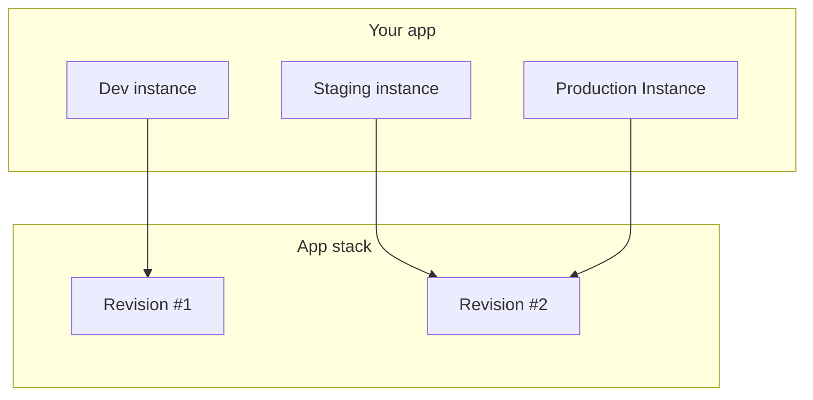

# Applications

## Overview

An application in Wodby is built on a [stack](stack.md) and can contain multiple [instances](instances.md). Each instance is a deployed copy of the app assigned to an [environment](env.md). Environments are named objects with a fixed type such as `prod`, `staging`, or `dev`. Creating a new application automatically generates its first instance.

- Every app can have an unlimited number of instances but at least one
- You can deploy as many instances as you want
- You can deploy instances of the same app across different [Kubernetes clusters](../clusters/index.md), including self-hosted K3S clusters on different servers
- One stack per application
- Different instances can have different revisions of the same stack

```mermaid
flowchart TD
    subgraph App2["<div style='margin-top:10px; white-space: nowrap;'>Your app</div>"]
        subgraph group[ ]
            Dev["Dev instance"]
            Staging["Staging instance"]
            Prod["Production Instance"]
        end
        style group fill:none,stroke:none,stroke-width:0px
    end   

    subgraph Stack["<div style='margin-top:10px; margin-right: 60px; white-space: nowrap;'>App stack</div>"]
        subgraph group3[ ]
            Rev1["Revision #1"]
            Rev2["Revision #2"]
        end
        style group3 fill:none,stroke:none,stroke-width:0px            
    end
    
    Dev --> Rev1
    Staging --> Rev2
    Prod --> Rev2
```

Use this section to create apps, understand how apps, instances, and app services relate, and deploy the same app across multiple environments.

## Quick model

| Object | What it means |
| --- | --- |
| App | The top-level application record |
| App instance | One deployed copy of that app, assigned to an Env |
| App service | One service inside one app instance |

See [App vs app instance vs app service](app-vs-instance-vs-service.md) for the fuller explanation.

## Creating New Application

There are 6 steps of creating a new application:

### Step 1

- Select the app `Owner`.
  - Choose `Organization <organization>` to create an organization-owned app.
  - Choose `Project <project>` to create a project-owned app.
- Select a stack
- In the selected stack you can:
  - select a version (option) of a service 
  - enable/disable optional services and change their configuration
  - configure resources request and limitation
  - configure autoscaling for scalable services

### Step 2

Select where you want to run the first instance of your application. The form offers two destinations:

1. **My clusters**
   - Choose one of your existing clusters
   - This can be a managed Kubernetes cluster created from a cloud [integration](../integrations/index.md)
   - It can also be a self-hosted [K3S](../clusters/k3s.md) cluster connected from _Clusters > Connect server_
2. **Wodby Cloud**
   - Wodby creates and manages a new cluster for this application
   - For persistent Wodby Cloud clusters you choose region, CPU type, machine type, and minimum and maximum node counts
   - Enable `Single-node cluster` when one fixed node is acceptable and you do not need high availability or cluster scaling
   - Persistent Wodby Cloud clusters require a paid plan
   - For testing, enable `Demo` to create a free temporary single-node Wodby Cloud cluster that is deleted automatically after 24 hours together with its applications

You can also create a Wodby Cloud cluster before creating an app from `Clusters > New Wodby Cloud cluster`.

### Step 3

- Enter the name of your application and your instance. Application and instance names are used to generate machine names. Machine names are permanent and cannot be changed
  - Application and instance machine names must follow the [general Kubernetes name rules](../naming.md#general-kubernetes-names)
  - The generated namespace, `<app-name>-<instance-name>`, must be 63 characters or shorter
- Select the [environment](env.md) (_Development_ by default)   
- Optionally, edit the root domain. By default it is `*.[instance-name].[app-name].[org-name].wodby.app`. This root domain is used to generate [technical domains](index.md) for services that expose public HTTP ports; ports marked `private` do not receive technical domains

### Step 4

Configure settings that apply to the whole app instance:

- Choose whether to enable stack auto-upgrades.
- Choose Public or Protected [App Access](access.md).
- Select the CI system and container registry when the app has an enabled service with a build source.

When adding another instance to an existing app, use `Copy configuration from` to prefill compatible app and service
fields from another instance. See
[Copying configuration to a new instance](instances.md#copying-configuration-to-a-new-instance) for what is copied and
the database-sharing behavior to review.

#### Auto-upgrades

Stack auto-upgrades default to enabled for development, staging, test, and feature environments and disabled for
production environments. You can override the suggested value before creating the app.

#### Access

`Public` is the default and uses ordinary Wodby routes. `Protected` publishes the app through an
[Application Access provider](../providers/access.md), such as Cloudflare or Tailscale. Select whether the provider
covers the entire app or selected endpoints, then complete its provider-specific settings. Some stacks require
Protected access.

See [App access](access.md) for route behavior, primary hostnames, and provider requirements.

#### CI/CD

The CI and registry settings remain visible at the bottom of the step. They are enabled when the app has at least one
enabled service with a build source and disabled otherwise.

Choose your [CI system](../cicd/index.md) and [container registry](../cicd/index.md). The form starts with the
[organization's configured defaults](../org.md#settings); if the organization has not selected external integrations,
it uses Wodby CI and Wodby Registry. You can override either choice for the new app instance without changing the
organization defaults or existing instances.

### Step 5

Configure individual app services. Sections only appear when the selected stack provides the corresponding capability.

#### Build sources

For services that support a build source, select how the source will be provided. When the app instance uses Wodby CI,
the source is a Git repository that contains your application code and pipeline manifests. When the app instance uses
third-party CI, the source can also be external, with builds created from `WODBY_APP_SERVICE_ID` and the provider
checkout.

Services often provide a public build boilerplate that you can use directly. With [GitHub](../providers/github.md) and
[GitLab](../providers/gitlab.md), Wodby can also create a new repository and import the boilerplate contents into it.
For [Bitbucket](../providers/bitbucket.md), create or copy the boilerplate repository manually first, then select it as
the build source.

#### Settings 

Configure [settings](../services/configuration.md#settings) for services that provide them.

#### Volumes 

Specify sizes and, when supported by the service revision, select a
[storage class](storage.md#choose-a-storage-class) for each persistent volume. The selector lists classes from the
chosen destination cluster, shows their provisioners, and marks and preselects the sole cluster default. Some services,
such as Redis, may provide optional volumes. For those, specifying size `0` means no persistent storage will be created.
The omitted volume remains available on the app service's `Volumes` tab and can be added later when persistent storage
is needed. Leaving an optional volume omitted is a valid configuration and does not produce a warning.

When a service-owned volume cannot apply an explicit class, the dashboard shows the safe cluster default in the same
selector but disables the control. A shared volume instead shows its linked storage service in a disabled selector; use
that linked service's own volume settings to choose the underlying storage class.

The storage-class choice applies when the volume is created. Existing bound volumes cannot be moved to another class
by editing the app. After creation, the app service's `Volumes` tab shows the
[configured and effective classes](storage.md#current-storage-class).

#### Integrations

Select [integrations](../integrations/index.md). If a service does not provide a dedicated integration, you can still attach a [_variable_](../integrations/variable.md) integration to a non-external service.

#### Databases

For internal database services, Wodby creates a new database server. For external cloud-database services, select the existing managed database server that the service should use.

#### Imports

Specify imports. For services that provide import functionality, such as database services, you can upload an archive or specify a public URL to import from.

### Step 6

Review your application configuration and click _Create new app_.

## Related pages

- [App vs app instance vs app service](app-vs-instance-vs-service.md)
- [Instances](instances.md)
- [App access](access.md)
- [App services](services.md)
- [Web terminal](web-terminal.md)
