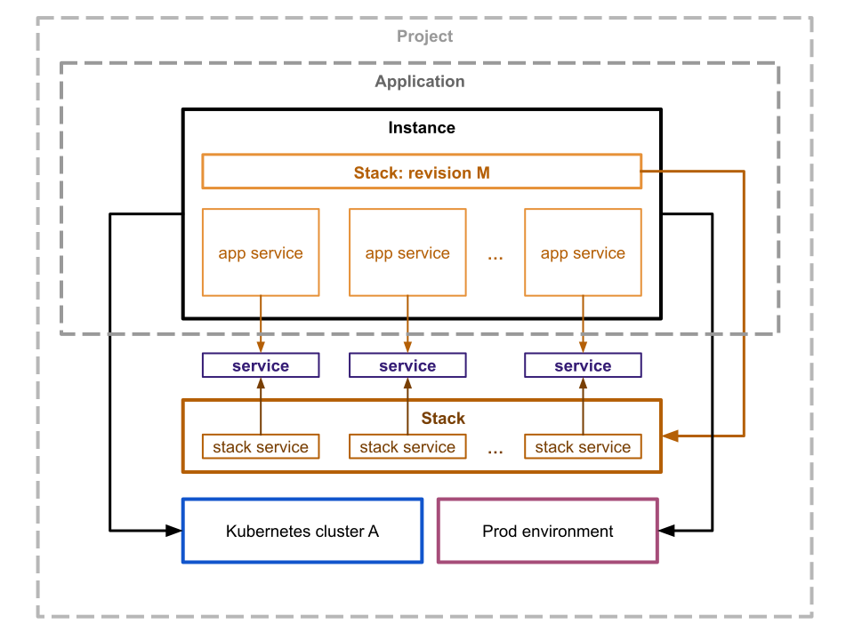

# Instances

Application instance is a single isolated copy of your application that deployed to a [kubernetes cluster](../kubernetes/index.md) and has:

- [environment](env.md) (like production, staging)
- [stack](stack.md) with a specific revision 
- [routes](routes.md) to configure domains and public ports
- [builds](builds.md) (if stack contains buildable services) and [deploys](deploys.md)
- [backups](backups.md) and [imports](imports.md) (if stack contains services that provide such)
- [app services](services.md) per each service that used to override stack configuration for this specific instance
- live [logs streaming](logs.md) 
- [cron](cron.md) schedules and jobs 
- [tasks](tasks.md) history 

You can remove or add a new instance from the _"[App] > Instances"_ page.

