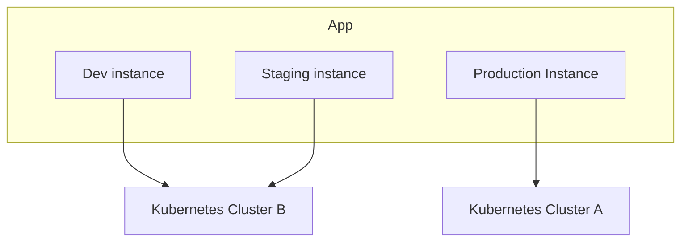

# Instances

```mermaid
flowchart TD
    subgraph App["<div style='margin-top:10px; white-space: nowrap;'>App</div>"]
        subgraph group[ ]
            Dev["Dev instance"]
            Staging["Staging instance"]
            Prod["Production Instance"]
        end
        style group fill:none,stroke:none,stroke-width:0px          
    end
    
    KubernetesA["Kubernetes Cluster A"]
    KubernetesB["Kubernetes Cluster B"]

    Dev --> KubernetesB
    Staging --> KubernetesB
    Prod --> KubernetesA
```

An app instance is one isolated deployment of your application on a [Kubernetes cluster](../clusters/index.md).

Each instance has its own:

- [Environment](env.md), which is a named Env with a fixed type such as `prod`, `staging`, or `dev`
- [Stack](stack.md) revision
- [Endpoints](endpoints.md) to configure HTTP routes and published ports
- [Builds](builds.md) and [deploys](deploys.md), when the stack has services with build configuration
- [Backups](backups.md) and [imports](imports.md), when the stack provides those capabilities
- [App services](services.md) used to override stack configuration for this specific instance
- [Metrics](observability.md#metrics), when cluster monitoring is enabled
- live [log streaming](observability.md#live-logs)
- [Cron](cron.md) schedules and jobs
- [Tasks](tasks.md) history

All instances of the same app share the same stack, but different instances can run on different clusters and different stack revisions.

App instances do not have a separate project owner. They belong to the app and use the app's ownership and sharing settings.

The instance machine name is permanent and must follow the [general Kubernetes name rules](../naming.md#general-kubernetes-names). The generated namespace, `<app-name>-<instance-name>`, must be 63 characters or shorter.

You add or remove instances from `Apps > [App] > Instances`.

## Pausing and resuming an instance

Open an app instance's `Settings` tab. Settings opens on `Edit` by default; select `Pause & Resume`, then
`Pause app instance`, when you want to stop the instance temporarily without deleting its configuration or data.
Pausing is available on paid plans. Resuming remains available so you can leave the paused state before a downgrade.

The status in this tab is `Running` during normal operation. It changes to `Pausing` while workloads are being stopped,
`Paused` after Kubernetes verifies the pause, and `Resuming` while workloads are being restored.

Pausing cancels active work for the instance, then:

- scales Deployments and StatefulSets to zero
- stops scheduled jobs and removes other active Kubernetes workload resources
- releases the workloads' requested compute and memory back to the cluster
- leaves routes, configuration, secrets, persistent volumes, and Helm releases in place

Automatic cron jobs and backups that become due while the instance is `Pausing`, `Paused`, or `Resuming` are skipped.
Wodby advances each schedule to its next run instead of queueing the missed execution for after resume. Managed
technical-domain certificates can still renew through DNS validation while the instance is paused, but renewal does
not restore or redeploy application workloads.

The instance's endpoints do not respond while it is paused. Persistent volumes and their data remain provisioned so the
instance can be resumed later. A pause has no automatic expiration.

After Kubernetes verifies that the workloads have stopped, the instance moves to `paused`. Select
`Resume app instance` from the same `Pause & Resume` tab to make its services count toward plan usage again and restore
the workloads and endpoints. Infrastructure app instances cannot be paused independently.

### Billing while paused

An instance continues to count toward app-service plan usage while the pause is in progress. After Kubernetes verifies
the pause, its enabled app services no longer count toward that usage. They count again before workloads are restored
when the instance resumes. Pausing does not cancel the organization's subscription, and the Team plan's $48 monthly
minimum still applies. A paid subscription cannot be downgraded while an instance is `Pausing` or `Paused`: wait for
any pause in progress to finish, resume every paused instance, then retry the downgrade. See
[Billing](../pricing.md#downgrading-a-paid-subscription).

For instances running on Wodby Cloud, persistent storage and cluster infrastructure are billed separately. Pausing an
instance does not itself resize or stop its cluster, although the freed workload capacity may allow a scalable cluster
to reduce its node count. This Wodby Cloud infrastructure note does not apply to clusters in your own cloud account,
where infrastructure costs are determined by your provider.

## Deleting an instance

Deleting an app instance marks it as `deleting` immediately and blocks new builds and deployments from starting.

Before Kubernetes cleanup begins, the deletion task cancels active builds, deployments, and post-deployment script
tasks for the instance and waits for each task to stop. It then removes the instance's Kubernetes resources and other
generated resources. Follow the deletion task logs to see which active tasks were canceled and whether cleanup
completed.

Deleting an app applies the same process to all of its instances.

## Errored instances

An app instance can move to `errored` when Wodby cannot finish creating it or cannot finish deletion cleanup.

Errored instances remain visible so you can inspect task logs and delete the instance. Operations that would create new
runtime work or change deployable configuration are blocked, including new builds and deployments, stack upgrades,
service configuration changes, route and auth changes, app-scoped backups, cron jobs, shell sessions, live logs, pod
queries, and container-backed database changes. Automatic app-scoped backups and cron jobs skip errored instances.
Managed technical-domain certificates can still renew through DNS validation, without deploying application workloads.

Review the failed task to find the cause. After fixing the underlying problem, delete the errored instance and create a
new one.

## Related pages

- [Applications overview](index.md)
- [App vs app instance vs app service](app-vs-instance-vs-service.md)
- [Application stack](stack.md)
