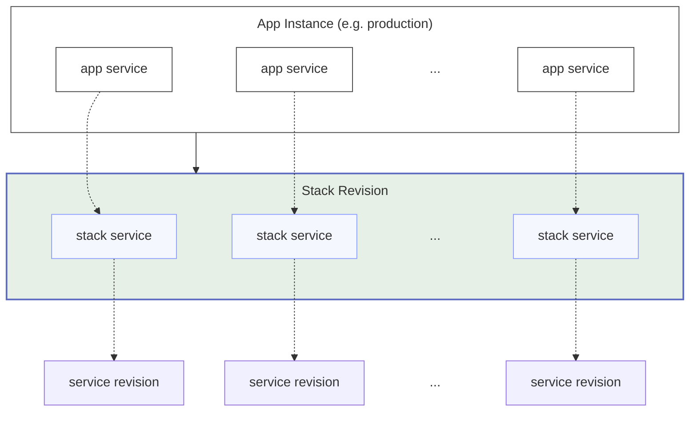

# Application Services

## Overview

An application service is the per-app-instance representation of a [stack service](../stacks/services.md).

When you create a new app, Wodby creates one app service for each relevant stack service. The app service starts with stack defaults, then lets you override behavior for that specific app instance.

The app service machine name comes from the stack service name and must follow the [Kubernetes service name rules](../naming.md#kubernetes-service-names).

This is the main place to customize how one environment behaves without changing the stack for every other environment.

## App service menu

Inside `Apps > [Instance] > Services > [Service]`, the dashboard can show:

- `Overview`
- `Metrics`
- `Configure`
- `Actions`
- `Database`
- `Integrations`
- `Env vars`
- `Helm`
- `Resources`
- `Links`
- `Volumes`
- `Settings`
- `Configs`
- `Tokens`
- `Annotations`

Not every app service gets every tab. The menu depends on the service type and whether it is external or derivative.

In general:

- `Metrics` appears only when cluster monitoring is enabled and the app service is not external or disabled
- `Actions` appears only when the service defines user-runnable actions
- `Database` appears only for services with database support
- `Env vars`, `Helm`, and `Resources` appear only for non-external services
- `Links`, `Volumes`, `Settings`, and `Configs` appear only when the service supports them
- `Tokens` appear only for non-external top-level services
- `Annotations` appear only for non-external services

## Overview tab

The `Overview` tab shows the current state of the app service, including:

- status
- machine name
- title
- version
- linked service revision
- container images
- build image, if the service is built
- last build
- last deploy

The same screen also exposes `Connect via web terminal`.

The web terminal button is available only when both the app instance and the app service are in a healthy `OK` state.
It opens an interactive shell session in a separate window. If the service has multiple workloads or containers, you
can target a specific one. Otherwise Wodby uses the primary workload and its first container automatically.

See [Web terminal](web-terminal.md) for the full behavior and requirements.

## Metrics tab

When cluster monitoring is enabled, non-external enabled app services expose a `Metrics` tab.

It shows aggregate runtime metrics for the service and detailed per-pod and per-container metrics, including:

- CPU and memory usage
- CPU and memory requests and limits
- persistent volume storage usage and capacity for volumes associated with the service
- pod and container readiness
- restart counts
- node placement
- container start, finish, and exit data

Storage usage is shown at the app service level. Per-pod and per-container storage usage is not reported separately,
because Kubernetes exposes PVC usage for volumes rather than individual containers.

## Actions

Some app services expose an `Actions` tab. It lists the user-runnable service actions available for that specific app
service. User-runnable actions are `button` and `output` actions.

Running an action creates a background task for the app service. Use the task details and logs to follow progress and
inspect command output. `output` actions do not return output directly in the run request.

Actions can appear disabled when the app instance or app service is not in a healthy `OK` state. They are not available
for external services or derivative app services.

## Configure tab

The `Configure` tab is the main operational form for the service.

Depending on the service, you can:

- enable or disable the service
- mark it as the main service when it exposes HTTP routes
- change the service version
- change the number of replicas for non-external services
- change build source settings for buildable services

Changing app-service configuration can mark the app instance as needing rebuild, because some changes affect the build output or deployment manifests.

### Build source

If a service is buildable, the app service includes build-source controls.

You can point the service to a Git repository and a reference such as:

- branch
- tag
- commit SHA

The available options depend on your CI mode and Git integrations. Build source is chosen during app creation, but can also be changed later from the app service.

## Database tab

The `Database` tab appears for services that can attach to a database resource.

From there you can choose:

- database user
- DB

The available choices are filtered by databases visible in the current project context and by actual user-to-DB access inside the selected database resource.

## Integrations tab

If a service supports integrations, the `Integrations` tab lets you attach compatible [integrations](../integrations/index.md) of the required [type](../integrations/types.md).

This is commonly used for storage, mail, monitoring, or other provider-backed features exposed by the service.

Variable integrations inject environment variables into runtime containers only. They are not passed to image builds.

## Env vars tab

The `Env vars` tab lets you add, remove, or override environment variables for the app service.

Some values are inherited and cannot be deleted directly, but they can usually be overridden. Inherited variables can come from:

- the service manifest
- the stack manifest
- linked services such as databases
- [settings](#settings-tab)

Env vars can be global for the whole service or scoped to a specific workload and container. If you do not specify a
target, the variable is applied to all containers in the service.

App-service env vars can be runtime-scoped, build-scoped, or both:

- runtime-scoped variables are injected into deployed containers
- build-scoped variables are passed to CI builds as Docker build arguments when the Dockerfile declares a matching `ARG`

If neither scope is selected, Wodby rejects the variable. Build-scoped app-service env vars are supported only for
buildable app services.

Changing a runtime-only env var marks the app service for redeploy. Changing a build-scoped env var marks it for
rebuild.

Wodby also adds runtime-only system variables to every container:

| Variable                    | Description                                                                              |
|-----------------------------|------------------------------------------------------------------------------------------|
| `WODBY`                     | Set to `true` inside Wodby-managed runtime containers                                    |
| `WODBY2`                    | Set to `true` inside Wodby-managed runtime containers                                    |
| `WODBY_APP_NAME`            | Machine name of the application                                                          |
| `WODBY_APP_INSTANCE_NAME`   | Machine name of the application instance                                                 |
| `WODBY_APP_SERVICE_NAME`    | Machine name of the app service                                                          |
| `WODBY_ENV_NAME`            | Name of the environment                                                                  |
| `WODBY_ENV_TYPE`            | Type of the environment                                                                  |
| `WODBY_HOSTS`               | List of hostnames from enabled HTTP routes                                               |
| `WODBY_PRIMARY_HOST`        | Hostname from the enabled main app service with an HTTP route                            |
| `WODBY_PRIMARY_URL`         | URL (`https` if certificate attached) of the enabled main app service with an HTTP route |

## Helm tab

The `Helm` tab lets you add or override Helm values for the app service.

Use this when a specific environment needs a chart-level override without changing the stack for every other
environment.

App-level Helm values override values coming from the service and stack. Helm values can also be stored as secrets.

## Resources tab

The `Resources` tab lets you configure CPU and memory requests and limits per workload and container.

CPU values are set in millicores, where `1000` means `1` CPU core. Memory values are set in megabytes in the dashboard UI.

Resource requests directly affect whether the service can be scheduled. If the cluster does not have enough available CPU or memory for the requested pod size, the pod stays pending until enough capacity becomes available. If cluster autoscaling is enabled, the cluster may add nodes to satisfy that demand.

Apps running on a demo cluster cannot change service resources.

### Replicas

Replicas are configured from `Configure`, but they directly affect service scaling.

Stateless app services can be scaled by increasing replicas for higher throughput and [high availability](high-availability.md). Replicas can also be adjusted automatically when [autoscaling](scalability.md) is enabled. Some stateful services expose their own replication behavior as part of the service design.

## Links tab

The `Links` tab lets you change [links](../services/links.md) between app services.

Links are usually defined in the stack, but app services can override them per app instance.

Those overrides also affect deployment ordering for that app instance. If linked services are deployed together, Wodby
deploys the linked target first.

## Volumes tab

The `Volumes` tab shows service volumes and their app-level values.

Volume resize is not supported for existing app instances. In practice, volume size is chosen during app creation and should not be treated as something you can resize later from this screen.

## Settings tab

The `Settings` tab lets you change values of [settings](../services/settings.md) exposed by the service.

These settings often flow into environment variables or runtime configuration generated by the service templates.
The service template decides whether each setting is runtime-scoped, build-scoped, or both. Changing a build-scoped
setting marks the app service for rebuild; changing a runtime-only setting marks it for redeploy.

## Configs tab

The `Configs` tab lets you view default [configs](../services/configs.md) and override them for this app service.

## Tokens tab

The `Tokens` tab lets you add or remove [tokens](tokens.md) that can be used in environment variables and other generated configuration.

Tokens can be plain or secret-backed. Secret-backed token values are revealed only on demand in the dashboard.

## Annotations tab

The `Annotations` tab lets you add custom annotations to the app service.

Like env vars, annotations can come from several sources:

- the service
- the stack
- Wodby system defaults

Inherited annotations are shown in the list, and app-level annotations can override them.

## Related pages

- [Endpoints](endpoints.md)
- [Builds](builds.md)
- [Deploys](deploys.md)
- [Environment](env.md)
- [Tokens](tokens.md)
