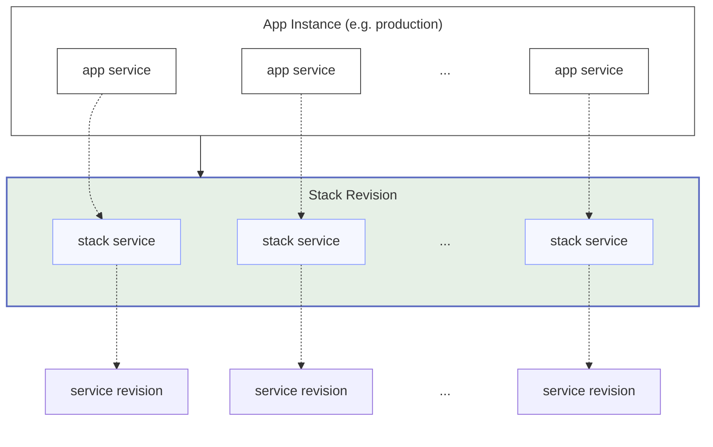

# Application Services

## Overview

```mermaid
flowchart TD
    subgraph APP["<div style='margin-top:10px; white-space: nowrap;'>App Instance (e.g. production)</div>"]
        subgraph sapp[ ]
            direction LR
            app1["app service"]
            app2["app service"]
            appEllipsis["..."]
            app3["app service"]
        end
        style sapp fill:none,stroke:none,stroke-width:0px
    end

    subgraph SR["<div style='margin-top:10px; white-space: nowrap;'>Stack Revision</div>"]
        subgraph sstack[ ]
            direction LR
            stack1["stack service"]
            stack2["stack service"]
            stackEllipsis["..."]
            stack3["stack service"]
        end
        style sstack fill:none,stroke:none,stroke-width:0px
    end

    subgraph sr[ ]
        direction LR
        svc1["service revision"] 
        svc2["service revision"] 
        svcEllipsis["..."]
        svc3["service revision"]
    end
    style sr fill:none,stroke:none,stroke-width:0px

    app1 -.-> stack1
    app2 -.-> stack2
    app3 -.-> stack3

    stack1 -.-> svc1
    stack2 -.-> svc2
    stack3 -.-> svc3

    APP --> SR

    classDef serviceRevision fill:#f0f0ff,stroke:#9370db,stroke-width:1px
    classDef stackRevision fill:#e6f0e6,stroke:#5c6bc0,stroke-width:2px
    classDef stackService fill:#f5f7ff,stroke:#8c9eff,stroke-width:1px
    classDef appInstance fill:#ffffff,stroke:#424242,stroke-width:1px
    classDef appService fill:#ffffff,stroke:#424242,stroke-width:1px
    classDef ellipsis fill:none,stroke:none

    class svc1,svc2,svc3 serviceRevision
    class SR stackRevision
    class stack1,stack2,stack3 stackService
    class APP appInstance
    class app1,app2,app3 appService
    class stackEllipsis,appEllipsis,svcEllipsis ellipsis
```

An application service is the per-app-instance representation of a [stack service](../stacks/services.md).

When you create a new app, Wodby creates one app service for each relevant stack service. The app service starts with stack defaults, then lets you override behavior for that specific app instance.

The app service machine name comes from the stack service name and must follow the [Kubernetes service name rules](../naming.md#kubernetes-service-names).

This is the main place to customize how one environment behaves without changing the stack for every other environment.

## App service menu

Inside `Apps > [App] > [Instance] > Stack > App services > [Service]`, the dashboard groups related pages under
primary tabs:

- `Overview`
- `Configuration`: `General`, `Variables`, `Helm`, `Settings`, `Configs`, `Tokens`, and `Annotations`
- `Connections`: `Integrations`, `Links`, and `Database`
- `Runtime`: `Resources` and `Volumes`
- `Actions`
- `Metrics`

Selecting Configuration, Connections, or Runtime opens its subtabs in a second navigation row. Actions and Metrics
remain direct tabs. Not every app service gets every tab or subtab; the menu depends on the service type and whether it
is external or derivative.

When an app service needs required configuration, the dashboard marks the affected subtab and its parent group.

In general:

- `Metrics` appears only when cluster monitoring is enabled and the app service is not external or disabled
- `Actions` appears only when the service defines user-runnable actions
- `Database` appears only for services with database support
- `Variables`, `Helm`, and `Resources` appear only for non-external services
- `Links`, `Volumes`, `Settings`, and `Configs` appear only when the service supports them
- `Tokens` appear only for non-external top-level services
- `Annotations` appear only for non-external services

## Overview tab

The `Overview` tab shows the current state of the app service, including:

- status
- machine name
- title
- version
- linked service revision
- container images
- build image, if the service is built
- last build
- last deploy

The same screen also exposes `Connect via web terminal`.

The web terminal button is available only when both the app instance and the app service are in a healthy `OK` state.
It opens an interactive shell session in a separate window. If the service has multiple workloads or containers, you
can target a specific one. Otherwise Wodby uses the primary workload and its first container automatically.

See [Web terminal](web-terminal.md) for the full behavior and requirements.

## Metrics tab

When cluster monitoring is enabled, non-external enabled app services expose a `Metrics` tab.

It shows aggregate runtime metrics for the service and detailed per-pod and per-container metrics, including:

- CPU and memory usage
- CPU and memory requests and limits
- persistent volume storage usage and capacity for volumes associated with the service
- pod and container readiness
- restart counts
- node placement
- container start, finish, and exit data

Storage usage is shown at the app service level. Per-pod and per-container storage usage is not reported separately,
because Kubernetes exposes PVC usage for volumes rather than individual containers.

## Actions

Some app services expose an `Actions` tab. It lists the user-runnable service actions available for that specific app
service. User-runnable actions are `button` and `output` actions.

Running an action creates a background task for the app service. Use the task details and logs to follow progress and
inspect command output. `output` actions do not return output directly in the run request.

Actions can appear disabled when the app instance or app service is not in a healthy `OK` state. They are not available
for external services or derivative app services.

## General configuration

The `Configuration > General` subtab is the main operational form for the service.

Depending on the service, you can:

- enable or disable the service
- mark it as the main service when its main endpoint exposes a public HTTP port
- change the service version
- change the number of replicas for non-external services when autoscaling is off; fixed services are limited to zero
  or one replica
- configure CPU-based autoscaling for supported services, including requested CPU, the minimum and maximum replica
  counts, and the average CPU utilization target
- change build source settings for services that support a build source

The main app service owns the app instance's root Wodby technical hostname. Selecting a different main app service
retargets that technical route to the new service's primary public HTTP endpoint. It does not replace the app
instance's canonical `Main` route, which may be a customer-added custom route.

Disabled, external, and derivative app services cannot be main. You can disable the current main app service: Wodby
selects another eligible enabled service for the root technical hostname, or removes that technical route when no
replacement exists. Disabling a service also disables its routes, including custom domains; it does not move those
customer routes to another service. Re-enabling the service re-enables routes that were disabled with the service, but
leaves routes you had disabled individually disabled.

For an app instance with an established runtime, re-enabling a service automatically starts a partial deployment of
that service and any required dependencies. If the app has not established its initial runtime, Wodby saves the enabled
state and marks the instance `needs redeploy` instead. Finish configuring the instance, then start its first deployment
explicitly. See [deferred initial deployment](deploys.md#deferred-initial-deployment).

An `EOL` flag next to a service version means that the app service currently uses a version whose end-of-life date has
passed. If newer supported versions are not available in the selector, update the app instance to a stack revision that
uses the latest service revision first, then choose a non-EOL service version.

Scaling and resource changes, including replicas, autoscaling rules, and requested CPU, mark the app instance as
needing redeploy. Changes that affect a built image, such as changing the version of a service with a build source,
mark it as needing rebuild instead.

### Build source

If a service supports a build source, the General page shows a separate `Build source` card with its own update action.

For Wodby CI, point the service to a Git repository and a reference such as:

- branch
- tag
- commit SHA

When the app instance uses third-party CI, linking a Git repository is optional for app services with build sources. You
can leave the repository unlinked and run the pipeline with `wodby ci init $WODBY_APP_SERVICE_ID`; Wodby CLI uses the
app service ID and metadata from the CI checkout to create the build.

To start builds from the dashboard, configure the provider-specific build source:

- GitHub Actions requires a linked repository, branch or tag, and a `workflow_dispatch` workflow file name or ID.
- GitLab CI requires a linked repository and branch or tag.
- CircleCI requires a linked repository and a previously recorded workflow.
- Custom CI builds always start in the external pipeline.

The available options depend on your CI mode and Git integrations. Build source is chosen during app creation, but can also be changed later from the app service.

## Database tab

The `Connections > Database` subtab appears for services that can attach to a database resource.

From there you can choose:

- database user
- DB

The available choices are filtered by databases visible in the current project context and by actual user-to-DB access inside the selected database resource.

## Integrations tab

If a service supports integrations, the `Connections > Integrations` subtab lets you attach compatible
[integrations](../integrations/index.md) of the required [type](../integrations/types.md).

This is commonly used for storage, mail, monitoring, or other provider-backed features exposed by the service.

Variable integrations inject environment variables into runtime containers only. They are not passed to image builds.

## Variables tab

The `Configuration > Variables` subtab lets you add, remove, or override environment variables for the app service.

Some values are inherited and cannot be deleted directly, but they can usually be overridden. Inherited variables can come from:

- the service manifest
- the stack manifest
- linked services such as databases
- [settings](#settings-tab)

Env vars can be global for the whole service or scoped to a specific workload and container. If you do not specify a
target, the variable is applied to all containers in the service.

App-service env vars can be runtime-scoped, build-scoped, or both:

- runtime-scoped variables are injected into deployed containers
- build-scoped variables are passed to CI builds as Docker build arguments when the Dockerfile declares a matching `ARG`

If neither scope is selected, Wodby rejects the variable. Build-scoped app-service env vars are supported only for app
services with build configuration.

Changing a runtime-only env var marks the app service for redeploy. Changing a build-scoped env var marks it for
rebuild.

Wodby also adds runtime-only system variables to every container:

| Variable                    | Description                                                                              |
|-----------------------------|------------------------------------------------------------------------------------------|
| `WODBY`                     | Set to `true` inside Wodby-managed runtime containers                                    |
| `WODBY2`                    | Set to `true` inside Wodby-managed runtime containers                                    |
| `WODBY_APP_NAME`            | Machine name of the application                                                          |
| `WODBY_APP_INSTANCE_NAME`   | Machine name of the application instance                                                 |
| `WODBY_APP_SERVICE_NAME`    | Machine name of the app service                                                          |
| `WODBY_ENV_NAME`            | Name of the environment                                                                  |
| `WODBY_ENV_TYPE`            | Type of the environment                                                                  |
| `WODBY_HOSTS`               | JSON list of accepted route and active App Access hostnames                              |
| `WODBY_PRIMARY_HOST`        | Protected primary hostname when App Access is configured; otherwise the enabled `Main` route hostname |
| `WODBY_PRIMARY_URL`         | URL for `WODBY_PRIMARY_HOST`; protected App Access URLs use `https`                      |

During an App Access change, `WODBY_HOSTS` can temporarily contain both the current and desired hostnames so the
workload accepts traffic throughout the transition. See [App access](access.md#primary-hostname).

## Helm tab

The `Configuration > Helm` subtab lets you add or override Helm values for the app service.

Use this when a specific environment needs a chart-level override without changing the stack for every other
environment.

App-level Helm values override values coming from the service and stack. Helm values can also be stored as secrets.

## Resources tab

The `Runtime > Resources` subtab lets you configure CPU and memory requests and limits per workload and container.

CPU values are set in millicores, where `1000` means `1` CPU core. Memory values are set in megabytes in the dashboard UI.

Resource requests directly affect whether the service can be scheduled. If the cluster does not have enough available CPU or memory for the requested pod size, the pod stays pending until enough capacity becomes available. If cluster autoscaling is enabled, the cluster may add nodes to satisfy that demand.

Apps running on a demo cluster cannot change service resources.

### Replicas

Replicas are configured from `Configuration > General`, but they directly affect service scaling.

Service revisions explicitly declare whether they support horizontal scaling. The service overview displays this
capability. Scalable services can run multiple replicas for higher throughput and
[high availability](high-availability.md), and their replicas can be adjusted automatically with
[autoscaling](scalability.md). Fixed services are limited to zero or one replica. Stateful replication that requires
service-specific topology, quorum, or failover is not represented as ordinary app-service scaling.

## Links tab

The `Connections > Links` subtab lets you change [links](../services/networking.md#links) between app services.

Links are usually defined in the stack, but app services can override them per app instance.

Those overrides also affect deployment ordering for that app instance. If linked services are deployed together, Wodby
deploys the linked target first.

## Volumes tab

The `Runtime > Volumes` subtab lists the volumes declared by the current service revision. Configured volumes show their app-level
values and the effective storage class observed on the live Kubernetes claim. A healthy volume shows its effective
class once. When the selected and effective classes differ or cannot be verified, the dashboard expands the value to
show both and adds a `Mismatch`, `Mixed`, `Unknown`, or `Unavailable` status.

An optional volume omitted during app creation remains in the table with an `Optional` label, empty size and storage
class values, and an `Add volume` action. This is a valid configuration, not a warning or configuration issue. Adding
the volume asks for a positive size and, when supported, a storage class. Shared volumes and volumes that reuse a
linked claim inherit their storage configuration. Saving the volume marks the app service and instance for redeploy;
the claim is created by the subsequent deployment.

After a volume has been added, it cannot be resized or removed from app-service settings, and its storage class cannot
be changed. See [Current storage class](storage.md#current-storage-class) for the status definitions and
[Choose a storage class](storage.md#choose-a-storage-class) for storage-class selection.

## Settings tab

The `Configuration > Settings` subtab lets you change values of
[settings](../services/configuration.md#settings) exposed by the service.

These settings often flow into environment variables or runtime configuration generated by the service templates.
The service template decides whether each setting is runtime-scoped, build-scoped, or both. Changing a build-scoped
setting marks the app service for rebuild; changing a runtime-only setting marks it for redeploy.

## Configs tab

The `Configuration > Configs` subtab lets you view default [configs](../services/configuration.md#configs) and override them for this app
service. The dashboard identifies whether a default comes from the service repository or from the selected service
image and shows image source details when available.

An app override takes precedence over the displayed default. Use `Reset override` to delete it. For an image-backed
config, resetting means the next deployment stops mounting the override and the container uses the file supplied by its
image; Wodby does not save a copy of the image default as another override.

## Tokens tab

The `Configuration > Tokens` subtab lets you add or remove [tokens](tokens.md) that can be used in environment
variables and other generated configuration.

Tokens can be plain or secret-backed. Secret-backed token values are revealed only on demand in the dashboard. You
need [runtime secret reveal permission](../access-control.md#secret-reveal-permissions) and recent
[secret reveal confirmation](../user/security.md#secret-reveal-confirmation) to display a secret-backed value.

## Annotations tab

The `Configuration > Annotations` subtab lets you add custom annotations to the app service.

Like env vars, annotations can come from several sources:

- the service
- the stack
- Wodby system defaults

Inherited annotations are shown in the list, and app-level annotations can override them.

## Related pages

- [Endpoints](endpoints.md)
- [Builds](builds.md)
- [Deploys](deploys.md)
- [Environment](env.md)
- [Tokens](tokens.md)
