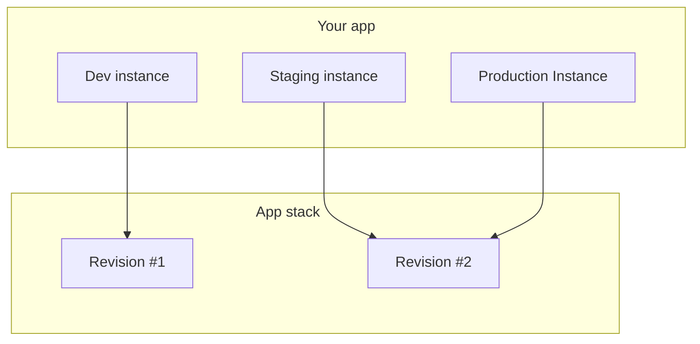

# Application stack

Every application is built from a stack.

Think of a stack as the blueprint for the app:

- it defines the services the app uses
- it defines default configuration for those services
- each stack change produces a new stack revision

All [app instances](instances.md) of the same app share the same stack, but they can run different stack revisions.

The usual model is one stack per application. When the stack changes, you upgrade instances revision by revision so environments can move forward at their own pace.

## Upgrade

When a new stack revision is available, you can upgrade an app instance to it.

Open `Apps`, select the app, select an app instance, and go to the `Stack` tab. The `App instance stack` table shows the
current stack revision, stack version, and status. The status is `Outdated` when a newer stack revision is available and
`Up to date` when the instance already uses the latest revision.

The `Upgrade stack` form is on the same tab. The `Upgrade` button is enabled only when the app instance is outdated. If
the instance already uses the latest stack revision, the button says `Stack is up to date`.

Wodby does not force every possible override during upgrade. Instead, the upgrade flow lets you decide which parts of the latest stack revision should replace the current app-instance overrides.

The reason is that app services can be customized per instance. Wodby cannot always tell whether an app-level value was
changed intentionally or whether it simply has not received a newer stack default yet.

If the app instance has buildable app services, the upgrade triggers rebuilds for those services because builds are tied to a specific stack revision.

The dashboard always upgrades to the latest stack revision. There is no revision selector in the upgrade form.

All upgrade options are disabled by default. `Update versions to default` and `Update replicas` are shown directly in
the form. The remaining options are under `Advanced settings`.

During upgrade, Wodby matches existing app services to stack services by stack service name.

- If a matching stack service still exists, the app service is moved to the new stack revision and the upgrade settings below decide which app-level values are replaced.
- If a stack service was added, Wodby creates the missing app service during the upgrade.
- If a stack service was removed, the obsolete app service is marked for deletion and its Kubernetes resources are uninstalled after the upgrade task.

Service revision, title, type, icon, and required status are updated to match the new stack service. Required services
are kept enabled even if the stack service is disabled.

The upgrade task logs the changes it applies and also logs when it detects a stack change but skips it because the
corresponding upgrade setting is disabled.

### Update versions to default

By default, Wodby keeps existing app-service versions during upgrade. Enable this option when you want top-level app
services to move to the default versions defined by the latest stack revision.

This does not stop the app service from moving to the latest service revision used by the stack. It controls the
app-service version option, such as the PHP, MariaDB, or Redis version selected for that service.

### Update replicas

When enabled, Wodby updates app-service replica counts to match the latest stack revision.

Replicas are not applied to app services that remain disabled. If the same upgrade also enables a service through
`Override enabled services`, replicas are applied after the service is enabled.

### Override resources

When enabled, Wodby updates resource requests and limits to the values from the latest stack revision.

If disabled, existing app-level resource values are kept. Resource records for stack-defined containers can still be
created when they did not exist before.

### Override integrations

When enabled, Wodby creates integrations defined by the latest stack revision and removes app-service integrations that
are no longer defined by the stack service.

If disabled, existing app-service integration selections are kept.

### Override enabled services

When enabled, Wodby aligns enabled and disabled services with the latest stack revision.

If disabled, existing app-service enabled or disabled state is kept for services that still exist in the stack. This
option does not keep obsolete app services when their stack service was removed.

### Override service settings

When enabled, Wodby replaces service-setting values with the latest stack defaults.

New settings introduced by the service revision are created during upgrade. If disabled, existing app-level setting
values are kept unless the setting changes from a direct value to a linked value or back.

### Override links

When enabled, Wodby updates service links to the latest stack configuration and deletes app-service links that no longer
exist in the stack service.

If disabled, existing link targets and extra app-service links are kept. Missing links from the new stack are still
created so newly introduced required connections can work.

### Override tokens

When enabled, Wodby recreates app-service tokens from the latest service and stack definitions.

When the same token name and environment type is defined in multiple places, Wodby applies service-defined tokens first,
then stack-wide tokens, then stack-service tokens.

If disabled, tokens are left unchanged. This avoids replacing secrets that may have been intentionally customized for
one app instance.

### Override configs

When enabled, Wodby replaces app-service config overrides with the latest stack configuration.

New configs introduced by the service revision are created when the stack provides an override. Existing config
overrides are kept when this setting is disabled.

### Override cron schedules

When enabled, Wodby updates cron schedules to match the latest service and stack configuration.

New cron schedules introduced by the service or stack are created during upgrade. Existing cron schedules are kept when
this setting is disabled.

### Override volumes

This option is shown in the dashboard as `Override volumes (may cause data loss)`.

When enabled, Wodby deletes app-service volume records that no longer exist in the latest service manifest.

New volumes introduced by the service revision are created during upgrade. Existing volume sizes are not changed for
running app instances.

### Override main app service

When enabled, Wodby changes the main app service to match the latest stack revision. This can trigger route reassignment, certificate re-issuance, and possible downtime.

If the current main app service was removed from the stack, Wodby updates the main service even when this option is not
selected, because the old main service can no longer stay active.

## Related pages

- [Applications overview](index.md)
- [Instances](instances.md)
- [App services](services.md)
- [Stack updates](../stacks/updates.md)
