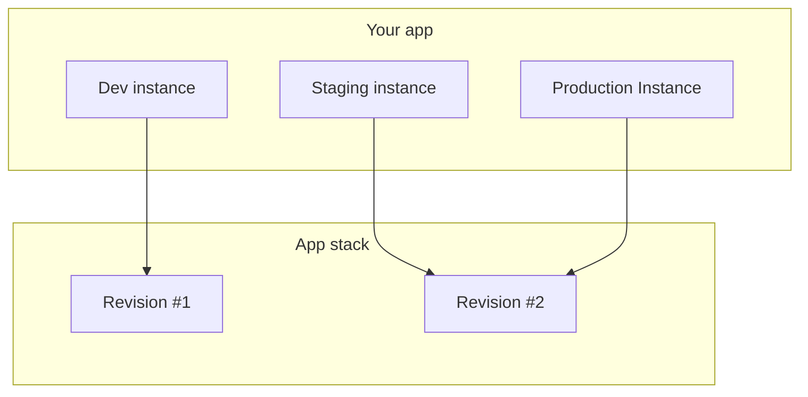

# Application stack

Every application is built from a stack.

Think of a stack as the blueprint for the app:

- it defines the services the app uses
- it defines default configuration for those services
- each stack change produces a new stack revision

All [app instances](instances.md) of the same app share the same stack, but they can run different stack revisions.

The usual model is one stack per application. When the stack changes, you upgrade instances revision by revision so environments can move forward at their own pace.

## Upgrade

When a new stack revision is available, you can upgrade an app instance to it.

Wodby does not force every possible override during upgrade. Instead, the upgrade flow lets you decide which parts of the latest stack revision should replace the current app-instance overrides.

If the app instance has buildable app services, the upgrade triggers rebuilds for those services because builds are tied to a specific stack revision.

We always upgrade to the latest stack revision.

### Update versions to default

By default, Wodby keeps the existing app-service versions during upgrade. Enable this option when you want the instance to move to the default versions defined by the latest stack revision.

### Update replicas

When enabled, Wodby updates app-service replica counts to match the latest stack revision.

### Override resources

When enabled, Wodby updates resource requests and limits to the values from the latest stack revision.

### Override integrations

When enabled, Wodby replaces linked integrations with the latest stack defaults.

### Override enabled services

When enabled, Wodby aligns enabled and disabled services with the latest stack revision.

### Override service settings

When enabled, Wodby replaces service-setting values with the latest stack defaults.

### Override links

When enabled, Wodby resets service links to the latest stack configuration.

### Override tokens

When enabled, Wodby replaces token values with the latest stack defaults.

### Override configs

When enabled, Wodby replaces config overrides with the latest stack configuration.

### Override cron schedules

When enabled, Wodby replaces cron schedules with the latest stack configuration.

### Override main app service

When enabled, Wodby changes the main app service to match the latest stack revision. This can trigger domain reassignment, certificate re-issuance, and possible downtime.

## Related pages

- [Applications overview](index.md)
- [Instances](instances.md)
- [App services](services.md)
