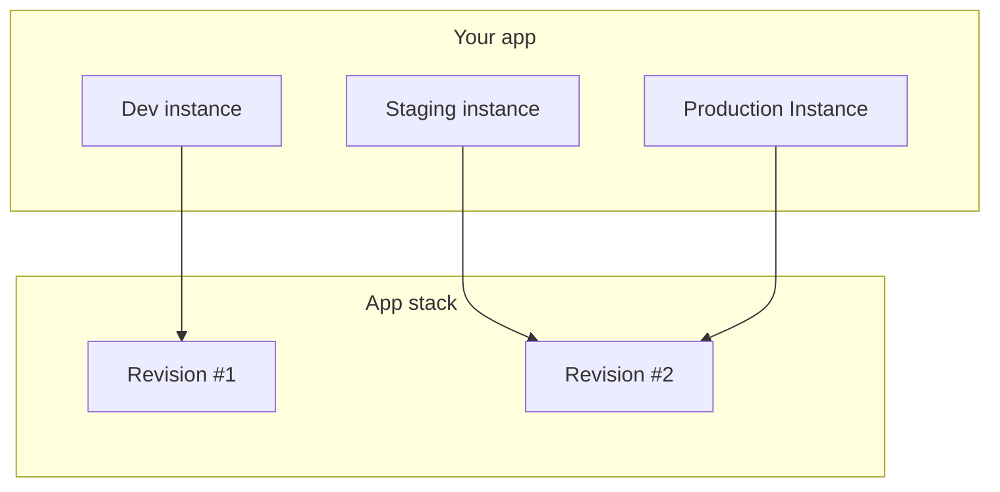

# Application stack

```mermaid
flowchart TD
    subgraph App2["<div style='margin-top:10px; white-space: nowrap;'>Your app</div>"]
        subgraph group[ ]
            Dev["Dev instance"]
            Staging["Staging instance"]
            Prod["Production Instance"]
        end
        style group fill:none,stroke:none,stroke-width:0px
    end   

    subgraph Stack["<div style='margin-top:10px; margin-right: 60px; white-space: nowrap;'>App stack</div>"]
        subgraph group3[ ]
            Rev1["Revision #1"]
            Rev2["Revision #2"]
        end
        style group3 fill:none,stroke:none,stroke-width:0px            
    end
    
    Dev --> Rev1
    Staging --> Rev2
    Prod --> Rev2
```

Every application is built from a stack.

Think of a stack as the blueprint for the app:

- it defines the services the app uses
- it defines default configuration for those services
- each published stack change produces a new stack revision

All [app instances](instances.md) of the same app share the same stack, but they can run different stack revisions.

The usual model is one stack per application. When the stack changes, you upgrade instances revision by revision so environments can move forward at their own pace.

## Upgrade

When a new published stack revision is available, you can upgrade an app instance to it. Unpublished stack drafts are
not available for app upgrades and do not mark app instances as outdated.

Open `Apps`, select the app, select an app instance, and go to `Stack > Operations`. The `Manual stack upgrade` card
shows the current stack revision, stack version, and status. The status is `Outdated` when a newer stack revision is
available and `Up to date` when the instance already uses the latest revision.

When an upgrade is available, the card shows the target stack version and revision. Its `Service changes` table
identifies stack services that will be added, removed, or moved to another service revision. The table shows the current
and target service versions and revision numbers. Stack services that use the same service revision in both stack
revisions are omitted.

The `Upgrade` button is enabled only when the app instance is outdated. If the instance already uses the latest stack
revision, the button says `Stack is up to date`.

Wodby does not force every possible override during upgrade. Instead, the upgrade flow lets you decide which parts of the latest stack revision should replace the current app-instance overrides.

The reason is that app services can be customized per instance. Wodby cannot always tell whether an app-level value was
changed intentionally or whether it simply has not received a newer stack default yet.

If the app instance has services with build sources, the upgrade triggers rebuilds for those services because builds are tied to a specific stack revision.

The dashboard always upgrades to the latest stack revision. There is no revision selector in the upgrade form.

All upgrade options are disabled by default. `Update versions to default` and `Update replicas` are shown directly in
the form. The remaining options are under `Advanced settings`.

### Review the upgrade changelog

Select `Show changelog` in the `Manual stack upgrade` card to load published release notes for service revision changes.
Wodby recalculates the latest published stack upgrade target when the changelog opens, so it can reflect an update that
was published after the page initially loaded.

For a newer semantic service version, the changelog includes stable release tags after the current version through the
target version. For same-version revision changes and other version formats, Wodby can show the target tag's notes when
the service is tag-backed. Added and removed services do not have release-note ranges. Release notes come from the Git
provider, so some updated services show that no published release notes were found.

The service-change table is not a complete configuration diff. A newer stack revision can change environment variables,
Helm values, links, resources, or other stack configuration without adding, removing, or changing a service revision.
When no service membership or revision changes are detected, the card and changelog call out that the revision may still
contain configuration changes.

## Auto-upgrade

An app instance can be configured to upgrade its stack automatically after the stack is automatically updated.
This is an app-instance setting, so production, staging, and development instances can use different behavior even when
they belong to the same app.

Auto-upgrade uses the same settings as the manual `Upgrade stack` form. The saved settings decide which app-instance
overrides Wodby replaces with values from the latest stack revision.

Auto-upgrade can run after supported automatic stack updates, including Git-backed stack auto-updates, automatic stack
service revision updates, and automatic sync with origin.

Use an [automation time window](../automation-time-windows.md) when an app instance should start automatic stack
upgrades only during selected hours.

The new app and new app instance forms enable auto-upgrade by default for development, staging, test, and feature
environments, and disable it by default for production environments. You can override this suggested value during
creation and change it later from the app instance stack settings. Enable auto-upgrade only where it is acceptable to
move to the latest stack revision without a manual review step. If the stack upgrade creates app services that need
extra configuration, Wodby records warnings and waits for you to finish the service configuration before deployment,
the same as a manual stack upgrade.

Manual stack updates, manual syncs, and manually published drafts do not force app instances forward. Use the manual
upgrade flow when you want to control the rollout yourself.

During upgrade, Wodby matches existing app services to stack services by stack service name.

- If a matching stack service still exists, the app service is moved to the new stack revision and the upgrade settings below decide which app-level values are replaced.
- If a stack service was added, Wodby creates the missing app service during the upgrade.
- If a stack service was removed, the obsolete app service is marked for deletion and its Kubernetes resources are uninstalled after the upgrade task.

Wodby does not delete a customer route implicitly when its target disappears. If the target stack revision would
remove an app service, endpoint, or port still used by a custom route, the upgrade stops before committing. Retarget or
delete the listed route, then retry the upgrade. Changes that only rename the primary endpoint or primary port preserve
the existing target and do not require retargeting.

Service revision, title, type, icon, and required status are updated to match the new stack service. Required services
must remain enabled.

The upgrade task logs the changes it applies and also logs when it detects a stack change but skips it because the
corresponding upgrade setting is disabled.

New app services may need app-specific configuration that cannot be selected safely at stack-upgrade time, such as a
build source, an external database, required integrations, or required settings. These gaps do not stop the
stack upgrade. Wodby records them as warnings on the upgrade task, creates the app service, and waits for you to finish
the service configuration before deploying.

Required service links are structural rather than post-upgrade configuration. The upgrade stops without committing if
a required link is missing, has an incompatible or disabled target while its source is enabled, or creates a dependency
cycle.

If a newly added service supports build boilerplates, Wodby uses the default build boilerplate automatically. If no
boilerplate is marked as default, the first boilerplate is used. If the default boilerplate cannot be applied, Wodby
records a warning and asks you to select the build source after the upgrade.

When a stack upgrade leaves unresolved service configuration, Wodby skips the automatic post-upgrade deployment.
Deployments are blocked until the app instance reports complete service configuration.

### Update versions to default

By default, Wodby keeps existing app-service versions during upgrade. Enable this option when you want top-level app
services to move to the default versions defined by the latest stack revision.

This does not stop the app service from moving to the latest service revision used by the stack. It controls the
app-service version option, such as the PHP, MariaDB, or Redis version selected for that service.

Use this when the latest stack revision changes an app service from an EOL default version to a supported default
version. If you want to choose a different supported version, upgrade the stack first and then edit the app service from
`Stack > App services`.

### Update replicas

When enabled, Wodby updates app-service replica counts to match the latest stack revision.

Replicas are not applied to app services that remain disabled. If the same upgrade also enables a service through
`Override enabled services`, replicas are applied after the service is enabled.

An exception applies when Wodby must enable a disabled app service to make it the main service. If that service has
zero replicas, Wodby restores the replica count from the target stack even when `Update replicas` is disabled, so the
root technical route does not target a service with no running pods.

### Override resources

When enabled, Wodby updates resource requests and limits to the values from the latest stack revision.

If disabled, existing app-level resource values are kept. Resource records for stack-defined containers can still be
created when they did not exist before.

### Override integrations

When enabled, Wodby creates integrations defined by the latest stack revision and removes app-service integrations that
are no longer defined by the stack service.

If disabled, existing app-service integration selections are kept.

### Override enabled services

When enabled, Wodby aligns enabled and disabled services with the latest stack revision.

If disabled, existing app-service enabled or disabled state is kept for services that still exist in the stack. This
option does not keep obsolete app services when their stack service was removed.

The preserved state must still satisfy required-service and required-link rules. Required services cannot be disabled.
A required-link target may be disabled only while its source is also disabled.

### Override service settings

When enabled, Wodby replaces service-setting values with the latest stack defaults.

New settings introduced by the service revision are created during upgrade. If disabled, existing app-level setting
values are kept unless the setting changes from a direct value to a linked value or back.

### Override links

When enabled, Wodby updates service links to the latest stack configuration and deletes app-service links that no longer
exist in the stack service.

If disabled, existing optional link targets and extra app-service links are kept. Missing links from the new stack are
still created. Required links are updated to the target stack mapping when necessary even when this option is disabled,
because an override cannot preserve a missing or obsolete required target. Link changes cannot create dependency cycles.

### Override tokens

When enabled, Wodby recreates app-service tokens from the latest service and stack definitions.

When the same token name and environment type is defined in multiple places, Wodby applies service-defined tokens first,
then stack-wide tokens, then stack-service tokens.

If the resulting definition generates a token that already exists with the same name and environment type, Wodby keeps
its current generated value. Enabling this option therefore updates token definitions without implicitly rotating
generated credentials. New generated tokens receive a new value, while literal token values follow the latest
definition.

If disabled, tokens are left unchanged. This avoids replacing secrets that may have been intentionally customized for
one app instance.

### Override configs

When enabled, Wodby replaces app-service config overrides with the latest stack configuration.

New configs introduced by the service revision are created when the stack provides an override. Existing config
overrides are kept when this setting is disabled.

### Override cron schedules

When enabled, Wodby updates cron schedules to match the latest service and stack configuration.

New cron schedules introduced by the service or stack are created during upgrade. Existing cron schedules are kept when
this setting is disabled.

### Override volumes

This option is shown in the dashboard as `Override volumes (may cause data loss)`.

When enabled, Wodby deletes app-service volume records that no longer exist in the latest service manifest.

New volumes introduced by the service revision are created during upgrade. Existing volume sizes are not changed for
running app instances.

Existing volume storage classes are also kept. For a new owned volume, Wodby refreshes the cluster's live
storage-class inventory and reuses one class configured consistently across existing owned volumes when possible;
otherwise it uses the one selectable default. The upgrade stops if the inventory cannot be refreshed or no unambiguous
class is available.
See [Application persistent storage](storage.md#changing-a-storage-class).

### Override main app service

When enabled, Wodby changes the main app service to match the latest stack revision. Wodby retargets the existing root
technical route to the new main app service's primary public HTTP endpoint while preserving the route's hostname,
certificate, settings, and canonical `Main` flag. A separate custom or technical `Main` route remains unchanged.

If this option is not selected and the current main app service can still own the root technical domain, it remains
main even when the target stack revision selects a different service.

Wodby applies the latest stack's main-service selection even when this option is not selected if the current main app
service cannot remain the technical-domain owner. This includes cases where it is removed, becomes external, no longer
exposes a public HTTP port on its main endpoint, or would be disabled by an enabled service override.

If this automatic fallback selects an app service that is currently disabled by an app-level override, Wodby enables
it even when `Override enabled services` is disabled. Enabling it can increase billable app-service usage, so Wodby
performs the normal quota and billing checks before committing the upgrade.

## Related pages

- [Applications overview](index.md)
- [Instances](instances.md)
- [App services](services.md)
- [Stack updates](../stacks/updates.md)
