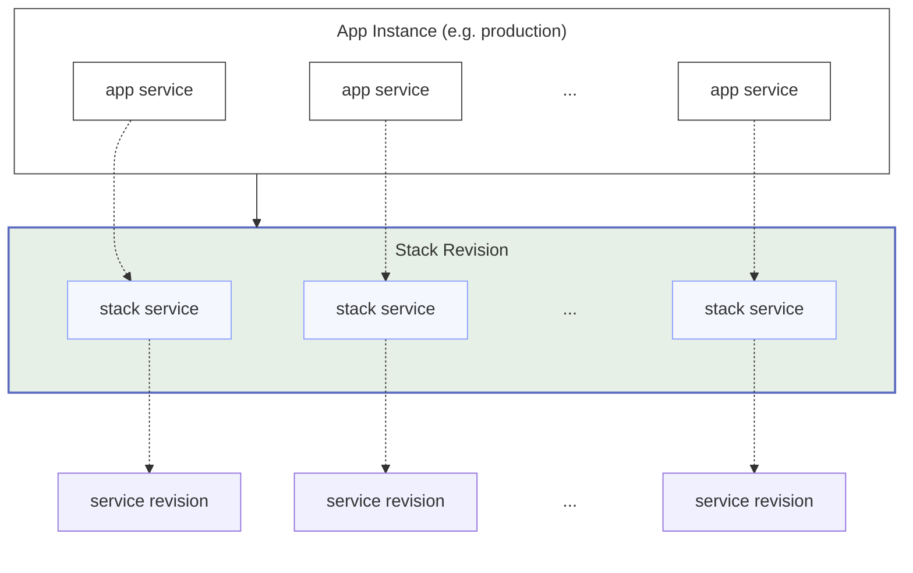

# Stack

Stack is a set of [services](../services/index.md) that you plan to use in your application. To create an application you need to choose a stack, instances of the same application use the same stack but revisions of the stacks they use may differ.

Stack is a versioned entity and can have multiple revisions. Every update made to a stack creates a new revision.

The intended use of a stack is to have a separate stack per each application or sometimes for multiple applications when they are small and alike. This way when you customize a stack you can be sure that all instances (environments) of the same application will get the update.

## Updates

When a service in a stack gets a new revision, your stack marked as outdated and can be updated. When you update a stack, the stack in your application will not be automatically updated, you can then upgrade your application stack for each instance individually.

When you create a stack by adding from a catalog this stack marked as one that _has an origin_. Such stack can be additionally _synced with origin_. This may be useful if you want to get some updates from the stack in the catalog (not all stack updates done via services, sometimes there can be an update to a stack itself like addition of a new service or a new stack-wide environment variable).

## Sharing

Stack is a project's entity, it can be shared between multiple projects (with writable or read-only permissions) but must be attached to at least one project.

