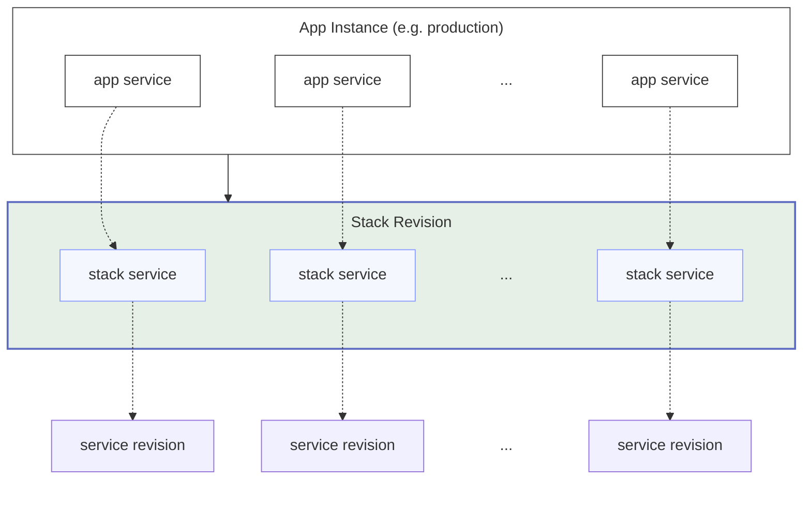

# Stack

A stack is the blueprint for an application.

It defines which [services](../services/index.md) the app uses and the default configuration for those services. To create an app, you choose a stack first.

All app instances of the same app share the same stack, but they can run different stack revisions.

Stacks are versioned. Every change creates a new stack revision.

The usual model is one stack per application. In some cases, multiple small similar apps may share a stack, but separate stacks are easier to evolve safely over time.

## Creating Stacks

You can create a stack in three ways:

- Add a stack from the catalog, then customize it. Catalog stacks start from a curated stack definition and keep an origin, so you can later sync catalog-side changes into your customized stack.
- Create a new stack from scratch. Use this when you want to choose services and defaults yourself in the dashboard instead of starting from a catalog stack.
- Import a stack from a Git repository. The repository defines one or more custom stacks using a [stack template](template.md), with each stack described by `stack.yml` and optional multi-stack `index.yml`.

After creation, all three paths produce regular versioned stacks. You can adjust their [configuration](configuration.md), add or remove stack services, and create apps from any available revision.

```mermaid
flowchart TD
    subgraph APP["<div style='margin-top:10px; white-space: nowrap;'>App Instance (e.g. production)</div>"]
        subgraph sapp[ ]
            direction LR
            app1["app service"]
            app2["app service"]
            appEllipsis["..."]
            app3["app service"]
        end
        style sapp fill:none,stroke:none,stroke-width:0px
    end

    subgraph SR["<div style='margin-top:10px; white-space: nowrap;'>Stack Revision</div>"]
        subgraph sstack[ ]
            direction LR
            stack1["stack service"]
            stack2["stack service"]
            stackEllipsis["..."]
            stack3["stack service"]
        end
        style sstack fill:none,stroke:none,stroke-width:0px
    end

    subgraph sr[ ]
        direction LR
        svc1["service revision"] 
        svc2["service revision"] 
        svcEllipsis["..."]
        svc3["service revision"]
    end
    style sr fill:none,stroke:none,stroke-width:0px

    app1 -.-> stack1
    app2 -.-> stack2
    app3 -.-> stack3

    stack1 -.-> svc1
    stack2 -.-> svc2
    stack3 -.-> svc3

    APP --> SR

    classDef serviceRevision fill:#f0f0ff,stroke:#9370db,stroke-width:1px
    classDef stackRevision fill:#e6f0e6,stroke:#5c6bc0,stroke-width:2px
    classDef stackService fill:#f5f7ff,stroke:#8c9eff,stroke-width:1px
    classDef appInstance fill:#ffffff,stroke:#424242,stroke-width:1px
    classDef appService fill:#ffffff,stroke:#424242,stroke-width:1px
    classDef ellipsis fill:none,stroke:none

    class svc1,svc2,svc3 serviceRevision
    class SR stackRevision
    class stack1,stack2,stack3 stackService
    class APP appInstance
    class app1,app2,app3 appService
    class stackEllipsis,appEllipsis,svcEllipsis ellipsis
```

## Updates

When a service used by the stack gets a new revision, or when stack-level configuration changes, the stack can become outdated and a new stack revision can be created.

Updating a stack does not automatically update all app instances using it. Each app instance can be upgraded to the latest stack revision separately.

If a stack was created from a catalog entry, it has an origin. You can sync it with that origin to pull catalog-side changes such as new services or new stack-wide defaults.

## Sharing

A stack can be project-owned or organization-owned. Sharing makes the stack visible and usable in additional projects. A `Modify/Delete` share marks the project-stack link as write-capable where supported, without changing the owner.

See [Sharing](../sharing.md) and [Access control](../access-control.md) for the full ownership and permission model.
