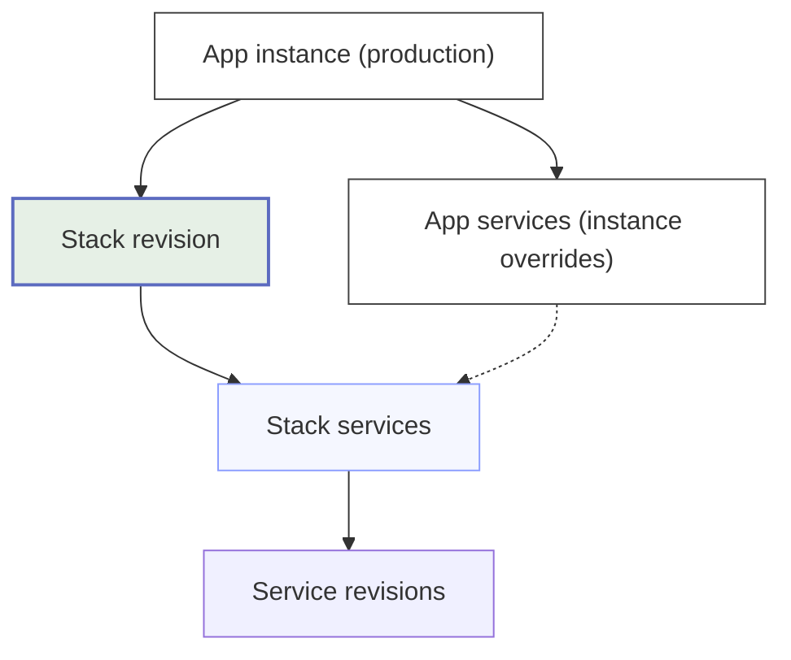

# Stack

A stack is the blueprint for an application.

It defines which [services](../services/index.md) the app uses and the default configuration for those services. To create an app, you choose a stack first.

All app instances of the same app share the same stack, but they can run different published stack revisions.

Stacks are versioned. Changes made in the dashboard are saved to an unpublished draft revision first. Publishing the draft creates a new stack revision. Discarding the draft removes the unpublished changes.

The usual model is one stack per application. In some cases, multiple small similar apps may share a stack, but separate stacks are easier to evolve safely over time.

Public Wodby stacks are listed in [`wodby/stacks`](https://github.com/wodby/stacks), with links to their source
repositories. To create a new stack in Git, start from the [`wodby/stack`](https://github.com/wodby/stack)
boilerplate.

## Create

You can create stacks from the dashboard catalog, from scratch in the dashboard, by duplicating an existing stack, from
Git, from a local manifest, or from a Helm scaffold.

After creation, all paths produce regular versioned stacks. You can adjust their [configuration](configuration.md), add
or remove stack services, publish changes as revisions, and create apps from any available published revision.

See [Create a stack](create.md).

## Model

```mermaid
flowchart TD
    AppInstance["App instance (production)"] --> StackRevision["Stack revision"]
    StackRevision --> StackServices["Stack services"]
    StackServices --> ServiceRevisions["Service revisions"]

    AppInstance --> AppServices["App services (instance overrides)"]
    AppServices -.-> StackServices

    classDef serviceRevision fill:#f0f0ff,stroke:#9370db,stroke-width:1px
    classDef stackRevision fill:#e6f0e6,stroke:#5c6bc0,stroke-width:2px
    classDef stackService fill:#f5f7ff,stroke:#8c9eff,stroke-width:1px
    classDef appInstance fill:#ffffff,stroke:#424242,stroke-width:1px
    classDef appService fill:#ffffff,stroke:#424242,stroke-width:1px

    class ServiceRevisions serviceRevision
    class StackRevision stackRevision
    class StackServices stackService
    class AppInstance appInstance
    class AppServices appService
```

## Updates

When a service used by the stack gets a new revision, or when stack-level configuration changes, the stack can become
outdated. Configuration edits create or update an unpublished draft first. Stack service revision updates, Git updates,
sync with origin, and automatic stack updates create a new stack revision directly after the update task succeeds.

Stacks can update stack service revisions to use the latest available service revisions without changing which services
the stack contains. Git-backed stacks can also update from Git, either manually or through Git auto-update when a
supported push event matches the stack source. Catalog-derived stacks can sync with their origin to pull in catalog-side
manifest changes.

Publishing the draft creates a new stack revision. Updating a stack does not automatically update all app instances
using it unless the stack was updated automatically and auto-upgrade is enabled for those app instances. Each app
instance can still be upgraded to the latest published stack revision separately.

See [Stack updates](updates.md) for the stack update workflows and [Application stack](../apps/stack.md#upgrade) for
the app instance upgrade settings.

## Sharing

A stack can be project-owned or organization-owned. Sharing makes the stack visible and usable in additional projects. A `Modify/Delete` share marks the project-stack link as write-capable where supported, without changing the owner.

See [Sharing](../sharing.md) and [Access control](../access-control.md) for the full ownership and permission model.
