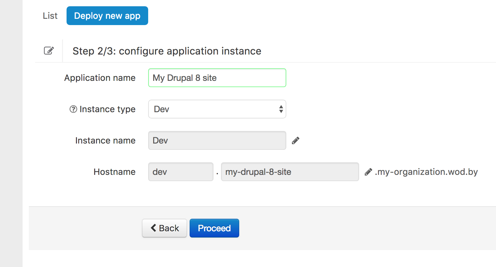

# Deploying New Application with Wodby

Deployment of the new applications consist of 2 simple steps:

## Step 1: Choose Server and Stack

Select one of the [**connected servers**](../servers/README.md) where you want to deploy your app. 
 
Choose a [**stack**](../stacks/README.md) for deployment. 

Some stacks such as Drupal allow to enable additional services such as cache storage, reverse caching proxy and others.
 
## Step 2: Application Details

Enter the name of your application. The URL for your application will be automatically generated based on this name, you can optionally adjust it.

### Optional Features

Some stacks like Drupal and WordPress provide additional deployment options such as deploying your code from [connected git repository](../git/connect/README.md) or content importing.

#### Git Integration

allow you to connect a [git repository](../git/README.md) that will be used as a source of codebase. Once you deploy an app, you will also be able to deploy new code. 
  
#### Content Import

Some stacks allow you to import content such as database and files. More details can be found in description of your stack page.
