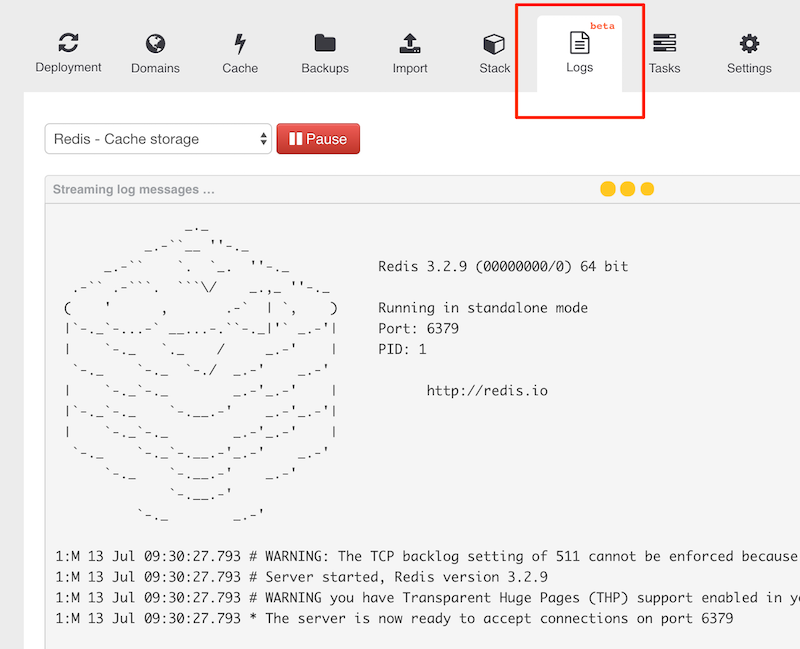

# Applications Logs

Most of the stacks provided by Wodby built in a way so all software running in containers stream their logs to the output of container and handled by Docker and Kubernetes. Logs are not persistent, if you restart a container (e.g. happens when you configure a service and redeploy stack) you will lose it. 

There 2 ways to get your applications logs:

## 1. Dashboard: Logs Streaming

Go to `Application > Logs`, choose a service (container) and click Stream. Last N log messages will be fetched, plus all new messages will be shown in real-time.

Log streaming is not available for the following stacks:

* Drupal stacks 3.x
* WordPress, all-new 4.x version with log streaming support is coming soon
* Some old custom stacks (redeploy the stack to make it work)

## 2. CLI

Go to `Application > Stack > Service` and copy `Show logs command`. Connect to the host server as root and run the command. Adjust the value of `tail` param to specify how many messages to fetch. For more params see [`kubectl logs reference`](https://kubernetes.io/docs/user-guide/kubectl/v1.7/#logs).

> Some software like JIRA and Cachet store their application logs in files inside of a container

> In some cases you can stream application's logs (e.g. watchdog in Drupal stack) to an additional syslog container via contrib modules/libraries like Monolog.
