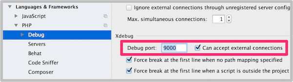

# Remote debugging with xdebug

To debug remote instance with <a href="http://xdebug.org/docs/install" target="_blank">xdebug</a> please follow these steps:

1. First of all you will need xdebug helper plugin for your browser. Just click a link below depending on your browser and follow their installation instructions: <a href="https://chrome.google.com/webstore/detail/xdebug-helper/eadndfjplgieldjbigjakmdgkmoaaaoc?hl=en" target="_blank">Google Chrome</a> or <a href="https://addons.mozilla.org/en-us/firefox/addon/the-easiest-xdebug/" target="_blank">Mozilla Firefox</a>

2. Now we need to set up xdebug forwarding for your localhost. Navigate `App apge > Settings > Debug`. Copy command specified in "Xdebug forwarding" area and execute it in your terminal. Make sure you have your xdebug run on port 9000 (Mac users might have php-fpm on this port), otherwise change it according to the port you use.

3. Now we have to make sure your IDE has the same port specified for xdebug and can accept internal connections. If you use PhpStorm go to `Preferences > Languages & Frameworks > PHP > Debug`.

4. Finally! Now you all set up. To start debugging you should `Start listening your debug connections` and enable xdebug helper plugin
