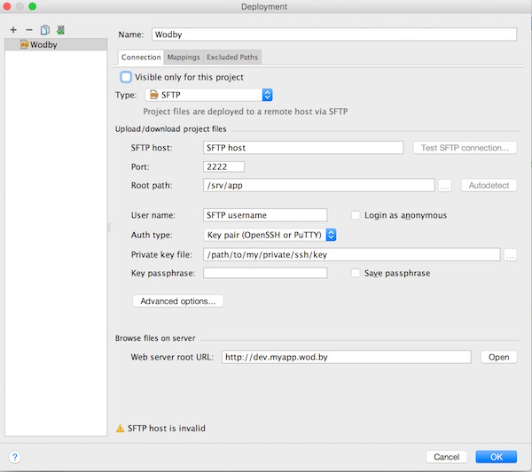

# Using Remote Workspace via SFTP (PhpStorm example)

1. Clone the app via git to your local machine

2. Run PhpStorm and open the directory with the cloned project

3. Go to `Tools > Deployment > Configuration`, add a new server with type SFTP

4. Navigate to `Stack > nginx-php` in the dashboard and copy/paste SFTP credentials. Specify the path to your private SSH key and make sure you've added the public key from the same pair to your Wodby profile. Click `Test SFTP connection` to make sure everything works.
 

5. Now go to tab `Mappings` and set `Deployment on server` path to `/`
 

6. Click `Tools > Deployment > Automatic Upload (always)`, so changes you make on your local machine were uploaded automatically every time you change it.

7. That's it. Now when you make changes, they automatically deploy on a remote server and you don't have to configure anything on your local machine.

> If you want to commit your changes, navigate to the codebase tab of your instance page, you will see all changes you've done. Just enter the commit message and click `Commit`.
