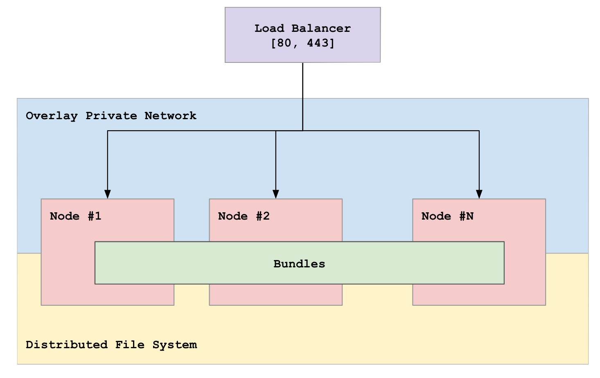

# Container-based Cluster

For large scale web applications we recommend to deploy the container-based cluster. Currently, we support cluster deployments to Amazon Web Services and Google Cloud Platform. We can use either your servers or ours (recommended), we don't charge extra for AWS resources.

## Key features

* High-availability. Servers pool consist of at least 2 servers. If one of the servers become unreachable, the system will re-deployed containers to another server
* Auto-scaling of servers and containers. Our system will automatically spin up another server and it to the pool when there's a lack of resources
* Load balancing. Our system will automatically balance extra load across multiple containers

## How it works

We create a pool of servers where containers will be deployed. Every server use the same distributed file storage and every container use the same overlay network. Once you [deploy an app](../apps/deploy.md) from the dashboard our system will automatically distribute containers across the servers. When there's not enough compute powers to handle all the containers the system will automatically spin up another server.
 
## Cattle vs Pet

This concept was presented by Gavin McCance at CERN in 2012.

In our container-based cluster every server treated as cattle not a pet. This means that we don't care if a particular server is running or not, if one of the servers goes down we simply schedule deployment of another server. 

In such a way server is just a unit of compute resources that can be added or removed when is not needed. All we care about are containers because your application works when containers work. 

This approach helps us to divide compute resources from the infrastructure. The job of a cloud provider is to provide reliable compute resource and ours, in a turn, is to provide the best infrastructure for your applications.

