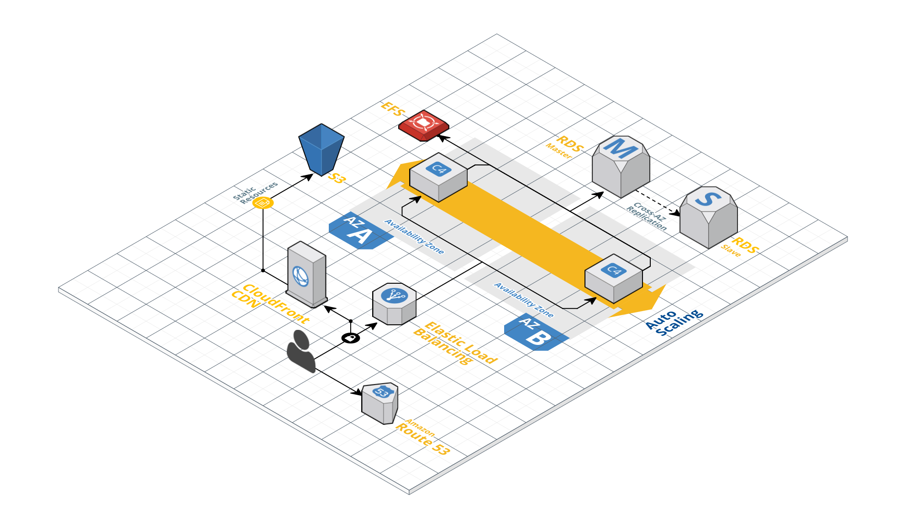

# Kubernetes Cluster

In addition to our single server infrastructure setup we offer a Kubernetes cluster solution. Currently, we offer cluster setup only for public clouds (AWS, GCP, Azure). 

Setup and maintenance of the cluster is significantly more complex and expensive than a single-server setup. Normally we recommend cluster setups only if you need one of the following:

* Scalability
* High availability
* Fault tolerance

## Kubernetes cluster on AWS

#### AWS Services:

* Route53 
* AWS Certificate Manager
* Elastic Load Balancing (ELB)
* Elastic Compute Cloud (EC2)
* Relational Database Service (RDS)
* Amazon Elastic File System (EFS) or Simple Storage Service (S3)
* Optional: CloudFront CDN
* Optional: ElastiCache

#### Basic concept

* Only specific stacks provided by Wodby are suitable for cluster deployment
* Domains will be hosted on Route53
* SSL certificates will be managed via AWS Certificate Manager
* Database server could be RDS or stateful container deployed to EC2 (only single AZ)
* Files can be stored on EFS or on S3 (requires integration on app side)
* CloudFront CDN can be used for S3 storage
* CI/CD workflow required for deployments
* Scalability can be on container level and node level
* Cluster will run under your AWS account
* Additional applications deployed to cluster will cost you additional money (ELB, traffic, usage) 

#### Available setups

Single availability zone:

* DB server can be either RDS or deployed as a stateful service to EC2
* No fault tolerance: if AZ goes down, your application goes down

Multi availability zones:

* We simultaneously run two complete copies of infrastructure in multiple AZ
* Multi-AZ RDS must be used as DB server
* Multi-AZ EFS or S3 must be used as file storage  

##### Optional features

* Centralized log streaming to Elasticsearch
* Monitoring and alerting via Grafana
* Integration with ElastiCache as scalable cache storage