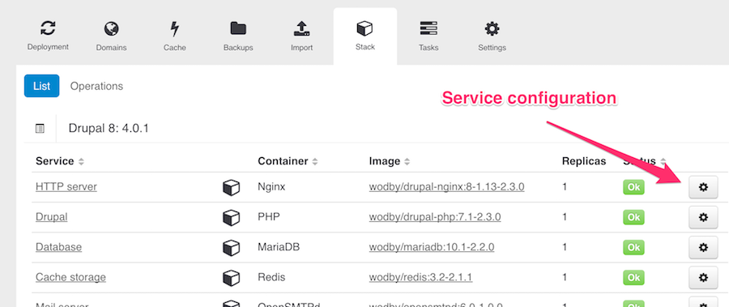

# Stack configuration 

You can customize stacks for specific application instance by configuring stack services via environment variables. Go to `Instance > Stack`, find a service you'd like to customize and click on a cogwheel icon. 

In a modal window you can:

* Edit environment variables for this service (often used for stack customization)
* Change implementation, e.g. switch from Apache to Nginx or change PHP version
* Enable or disable stack service (available only for optional services)
* Change number of container replicas
* Change [deployment strategy](template.md#deployment): rolling update or recreate
* Change docker image tag (available for custom stacks only) 

To apply changes you must redeploy your stack.

## Resources 

You can configure resources (Memory and CPU) requests and limits per container.

Request is a minimum amount of RAM (in megabytes) and/or CPU (in cores) that must be available on the server in order to deploy a container. A container with CPU request equal to `0.5` cores is guaranteed half as much CPU as one that asks for 1 CPU. CPU is always requested as an absolute quantity, never as a relative quantity; 0.1 is the same amount of CPU on a single-core, dual-core, or 48-core machine.

The amount of available resources on a server is NOT defined by the actual (real) resources usage but calculated as a difference between total server resources and total resources requests of all containers deployed to this server. 

Limit is the maximum of resources that container allowed to consume. If a container reaches the limit of RAM it will start using swap space (if available), if swapping disabled the container will be terminated. If it is restartable, it will be restarted, as with any other type of runtime failure.

CPU limit is the total amount of CPU time that a container can use every 100ms. A container cannot use more than its share of CPU time during this interval, it will not be killed for excessive CPU usage.

If you specify a limit without specifying a request, the request will be set equal to the limit.  

## Ports

You can publish container ports via two methods: via edge (controlled under Domains tab) and set a dynamic high port (generated port can be found on a service page). 

## Custom Docker Image

If changes you need to make can't be done via environment variables there's always an option to use a custom docker image:
  
1. [Build](https://docs.docker.com/engine/reference/builder/) your own docker container image based in ours (`FROM` instruction)
2. Fork our stack 
3. Replace a service image to your in the template 
4. Deploy a new app with your custom stack
