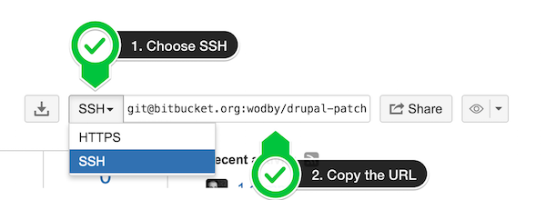

# Connecting BitBucket repo

1. Go to your repository page on BitBucket. Choose SSH type of the clone URL and copy it

2. Navigate `My repos > Connect` and paste copied URL

3. Click `Connect the repository`. Copy the deployment key generated by Wodby. You have 2 options how to add this key to your repo:
 
    - **With writable access:** in case you want to use [remote workspace](../../apps/remote-workspace/README.md) feature: 
        - Add a new user to the repo and add him writable key 
        - Navigate to `Profile > BitBucket settings > SSH Keys`. Add the key generated by Wodby
    - **Read-only access:** add as a deployment key

4. Now you can create/import new apps using your git repo