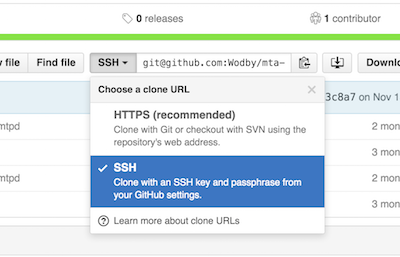

# Connecting GitHub repo

1. Go to your repository page on GitHub. Choose SSH type of the clone URL and copy it

2. Navigate `My repos > Connect` and paste copied URL

3. Click `Connect the repository`. Copy the deployment key generated by Wodby

4. Go to your GitHub repository page. Navigate `Settings > Deploy keys`. Paste the deploy key generated by Wodby. **In case you want to use [remote workspace feature](../../apps/remote-workspace/README.md)** make sure you've checked `Allow write access`

5. Great! Now you can create/import new apps using your git repo