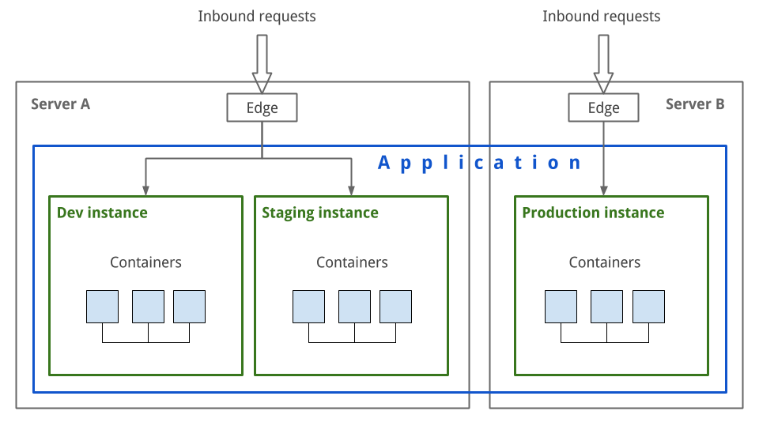

# Infrastructure

When you [connect a server](../servers/README.md) to Wodby we deploy [container-based](../stacks/containers.md) infrastructure to this server. This will further allow you to deploy environment [for your applications](../apps/deploy.md) which we call [stacks](../stacks/README.md). 

Both server infrastructure and stacks have versioning. We regularly update them by releasing [newer versions](versioning.md), such updates can include security updates and performance improvements.
 
> The infrastructure we provide is based on [containers](../stacks/containers.md) and powered by Docker and Kubernetes.

## Schema

Basic concepts:

* [Stacks](../stacks/README.md)
* [Containers](../stacks/containers.md)
* [Infrastructure versioning](versioning.md)

Further reading:

* [Adding SSH Key](keys.md)
* [Cloudflare integration](cloudflare.md)
* [Configuring UFW](ufw.md)
* [HTTP Strict Transport Security (HSTS)](hsts.md)
* [Integration with CloudFlare](cloudflare.md)
