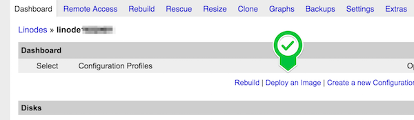
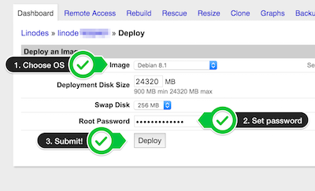
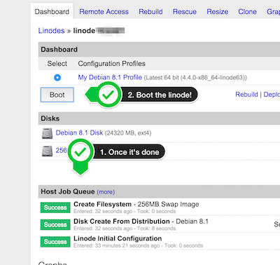

# Connecting Linode

**Debian 8 provided by Linode is not compatible (because of custom kernel), please use Ubuntu instead**

Currently, we don't have a native integration with Linode. But you still can connect your server by following these steps: 

1. Login to <a href="https://manager.linode.com/" target="_blank">Linode manager</a> 

2. Spin up a new linode
 

3. Wait for linode being created. Once its status is set to "Brand New". Navigate to this linode dashboard
 

4. Click "Deploy an image"
 

5. Choose image attributes (list of [supported OS](../supported-os.md)) and deploy
 

6. Wait until all disks are create and boot the linode
 

7. Now it's all set on Linode's side. Now connect the server (`Servers > Connect > Linode`) and follow the instructions