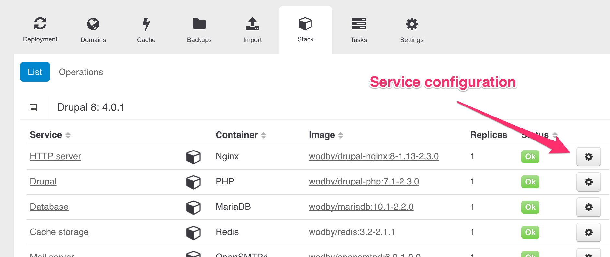

# Stack Configuration 

You can customize stacks for specific application instance by configuring stack services via environment variables. Go to `Instance > Stack`, find a service you'd like to customize and click on a cogwheel icon. 

In a modal window you can edit environment variables for this service, disable it (available only for optional services) and manage # of replicas.

To apply changes you must [redeploy](redeployment.md) your stack.

## Custom Docker Image

If changes you need to make can't be done via environment variables there's always an option to use a custom docker image:
  
1. [Build](https://docs.docker.com/engine/reference/builder/) your own docker container image based in ours (`FROM` instruction)
2. Fork our stack 
3. Replace a service image to your in the template 
4. Deploy a new app with your custom stack
