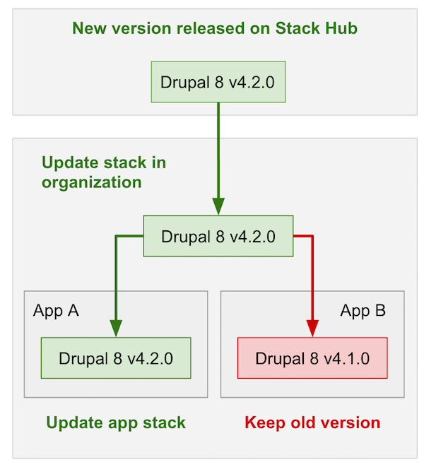

# Stack Versioning

We regularly update stacks by releasing new versions, such updates can include security updates and performance improvements. You can find more details under the Changelog tab on a stack page.

The stack has a requirement for the minimal [version of infrastructure](../infrastructure/versioning.md) of the server where this stack is deployed. You can find a stack's version of your application on the list of your apps or under `Stack` tab of your [instance](../apps/instances.md). If a stack is outdated you will see an appropriate indicator.

## Updating Stack in Organization

When a new version of a stack has been released on [Stack Hub](https://cloud.wodby.com/stackhub) your stack will be marked as outdated. You can update a stack to the latest version from a stack page in your organization. The update of a stack will **not affect** your applications, it only updates the version of a stack inside of your organization.

## Upgrading Application Stack

Once you update a stack in your organization, you can upgrade the application instances. Go the `[Instance] > Stack > Operations` page and click Upgrade. The downtime depends on the number of services affected in a new version and what <a href="template.html#deployment">deployment strategy</a> used in these services. 
